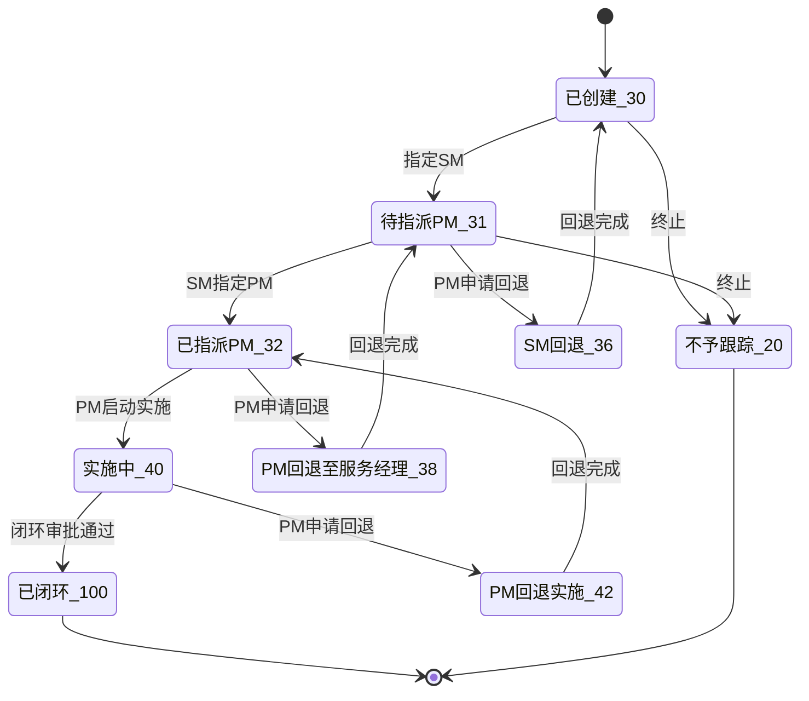
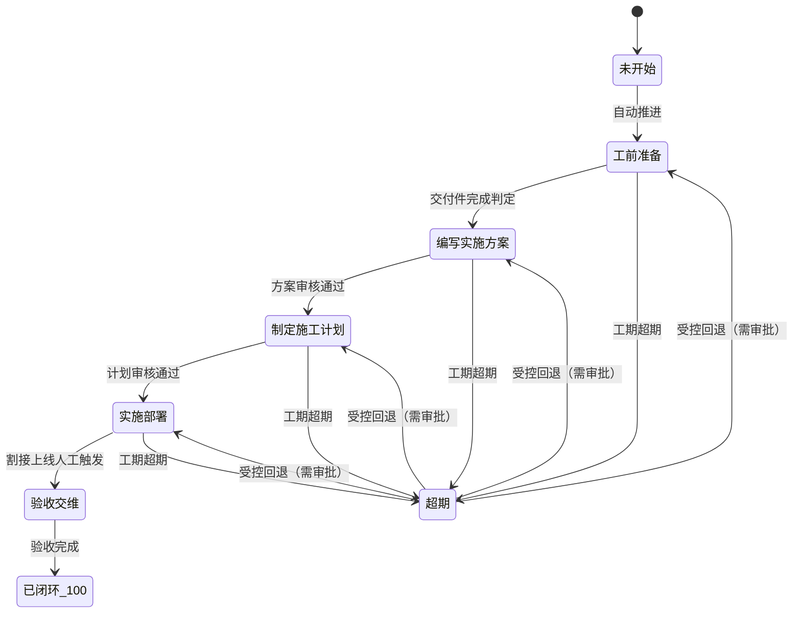
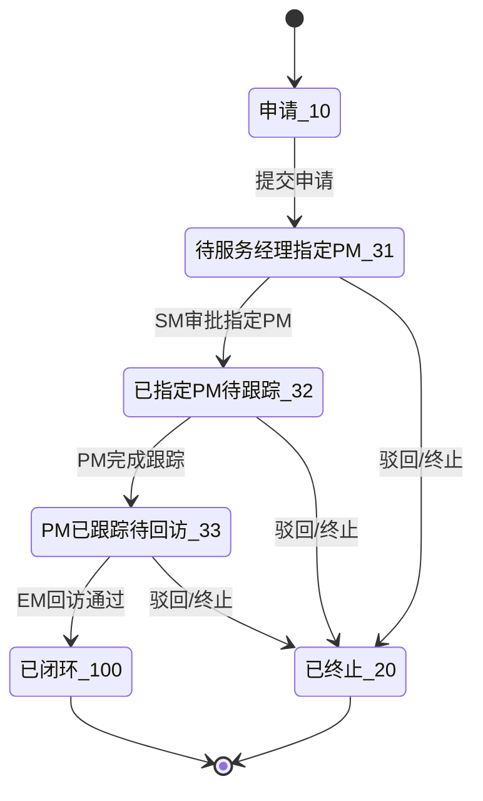
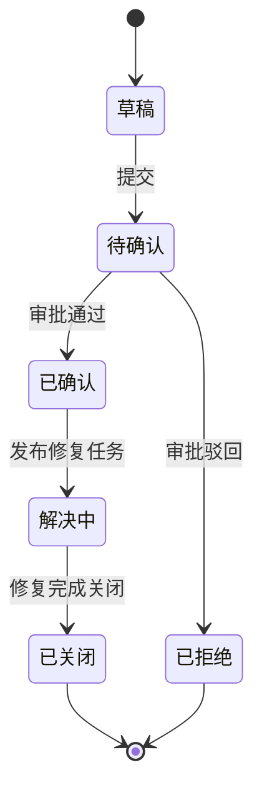

# Data Model: PMS 项目管理系统（合并规格）

> **来源**: `spec.md`（003-pms-consolidated 分支）
> **覆盖实体**: 40 个 Key Entities（37 个 spec 显式列出 + 3 个由 FR 推导补全：FixTask / CallbackQuestionnaire / ProjectGroup）
> **状态**: Draft
> **最后更新**: 2026-07-10

---

## 1. 实体关系总览

### 1.1 Mermaid erDiagram

```mermaid
erDiagram
    Project ||--o{ Member : "1:N 项目成员"
    Project ||--o{ ProductList : "1:N 产品清单"
    Project ||--o{ DeviceSerial : "1:N 设备序列号"
    Project ||--o{ Weekly : "1:N 周报"
    Project ||--o{ SiteSurvey : "1:1 工勘"
    Project ||--o{ Requirement : "1:1 需求分析"
    Project ||--o{ ConstructionPlan : "1:1 施工计划"
    Project ||--o{ ImplementationPlan : "1:1 实施方案"
    Project ||--o{ Deliverable : "1:N 交付件"
    Project ||--o{ Callback : "1:N 回访"
    Project ||--o{ Maintenance : "1:N 维保"
    Project ||--o{ CutOverOrder : "1:N 割接单"
    Project ||--o{ UserContact : "1:N 客户联系人"
    Project ||--o{ ProjectGroup : "N:N 项目组"
    Project ||--o{ Project : "1:N 主子项目"
    Project }o--|| Contract : "N:1 合同"
    Project }o--|| User : "N:1 下单客户"
    Project }o--|| User : "N:1 最终用户"
    Project }o--|| BusinessScenarioTemplate : "N:1 业务场景模板"

    PresalesProject ||--o{ ProductList : "1:N 产品明细"
    PresalesProject ||--o{ TemporaryLicense : "1:N 临时授权"
    PresalesProject ||--o{ Callback : "1:N 回访"

    SubcontractProject ||--|| Project : "N:1 归属子项目"
    SubcontractProject }o--|| Facilitator : "N:1 服务商"
    SubcontractProject ||--o{ Deliverable : "1:N 交付件"
    SubcontractProject ||--o{ Callback : "1:N 回访"

    Prob ||--o{ FixTask : "1:N 修复任务"
    Prob }o--o{ DeviceSerial : "N:N 受影响设备"

    DeviceSerial ||--o{ ConfigLog : "1:N 配置Log"
    DeviceSerial ||--|| DeviceEnhancement : "1:1 设备增强"
    DeviceSerial }o--|| ProductList : "N:1 产品清单"

    CutOverOrder ||--o{ CutOverResource : "1:N 割接资源"
    CutOverOrder }o--o{ SparePart : "N:N 备件"
    CutOverOrder }o--|| Project : "N:1 归属项目"

    ITRTicket ||--|| RMAOrder : "1:1 硬件故障"
    ITRTicket }o--|| DeviceSerial : "N:1 设备"
    ITRTicket }o--|| User : "N:1 用户"
    ITRTicket }o--o| Prob : "N:1 关联技术公告"

    User ||--o{ UserContact : "1:N 联系人"
    User ||--o{ CustomerArchive : "1:N 客户档案"
    User }o--o{ Role : "N:N 角色分配"
    User }o--|| Department : "N:1 部门"

    KnowledgeBase ||--o{ TroubleshootingExperience : "1:N 排障经验"
    InspectionTask }o--|| DeviceSerial : "N:1 设备"
```

### 1.2 实体清单与业务域归属

| # | 实体名（中文） | 实体名（英文） | 业务域 | 来源 |
|---|---|---|---|---|
| 1 | 项目 | Project | 项目生命周期 | 001+002 |
| 2 | 项目成员 | Member | 项目生命周期 | 002 |
| 3 | 项目合同 | Contract | 项目生命周期 | 002 |
| 4 | 项目周报 | Weekly | 项目生命周期 | 002 |
| 5 | 项目组 | ProjectGroup | 项目生命周期 | 002 |
| 6 | 产品信息清单 | ProductList | 交付生命周期 | 001 |
| 7 | 工勘记录 | SiteSurvey | 交付生命周期 | 001 |
| 8 | 需求分析 | Requirement | 交付生命周期 | 001 |
| 9 | 施工计划 | ConstructionPlan | 交付生命周期 | 001 |
| 10 | 实施方案 | ImplementationPlan | 交付生命周期 | 001 |
| 11 | 交付件 | Deliverable | 交付生命周期 | 001 |
| 12 | 回访申请 | Callback | 交付生命周期 | 002 |
| 13 | 回访问卷 | CallbackQuestionnaire | 交付生命周期 | 002 |
| 14 | 割接单 | CutOverOrder | 割接管理 | 001 |
| 15 | 割接资源 | CutOverResource | 割接管理 | 001 |
| 16 | 备件 | SparePart | 割接管理 | 001 |
| 17 | 售前测试项目 | PresalesProject | 售前管理 | 002 |
| 18 | 临时授权 | TemporaryLicense | 售前管理 | 001 |
| 19 | 转包项目 | SubcontractProject | 转包管理 | 002 |
| 20 | 服务商 | Facilitator | 转包管理 | 002 |
| 21 | 维护记录 | Maintenance | 维保管理 | 002 |
| 22 | 技术公告 | Prob | 技术公告 | 001+002 |
| 23 | 修复任务 | FixTask | 技术公告 | 002 |
| 24 | 设备序列号 | DeviceSerial | 设备信息增强 | 001+002 |
| 25 | 配置Log | ConfigLog | 设备信息增强 | 001 |
| 26 | 设备信息增强 | DeviceEnhancement | 设备信息增强 | 001 |
| 27 | 巡检任务 | InspectionTask | 服务平台集成 | 001 |
| 28 | AI排障知识库 | KnowledgeBase | AI 排障 | 001 |
| 29 | 排障经验 | TroubleshootingExperience | AI 排障 | 001 |
| 30 | 用户 | User | 用户管理 | 001+002 |
| 31 | 客户联系人 | UserContact | 用户管理 | 001 |
| 32 | 客户档案 | CustomerArchive | 用户管理 | 001 |
| 33 | ITR问题单 | ITRTicket | ITR 故障处理 | 001 |
| 34 | RMA工单 | RMAOrder | ITR 故障处理 | 001 |
| 35 | 角色 | Role | 系统管理 | 002 |
| 36 | 部门 | Department | 系统管理 | 002 |
| 37 | 基础数据 | BasicData | 系统管理 | 002 |
| 38 | 工作流任务 | WorkflowTask | 系统管理 | 002 |
| 39 | 操作日志 | OperateLog | 系统管理 | 002 |
| 40 | 跨系统集成点 | IntegrationPoint | 系统管理 | 001 |

---

## 2. 状态机设计

### 2.1 Project 双层并行状态机

**顶层生命周期状态机**（来源: 002 状态码）：

| 状态码 | 状态名 | 说明 | 终态 |
|--------|--------|------|------|
| 30 | 已创建 | 项目初始状态，合同录入后生成 | 否 |
| 31 | 待指派PM | 已指定服务经理，等待指派项目经理 | 否 |
| 32 | 已指派PM | PM 已指派，等待启动实施 | 否 |
| 40 | 实施中 | 进入交付阶段，内嵌 8 个交付子阶段 | 否 |
| 100 | 已闭环 | 项目闭环归档（终态） | 是 |
| 20 | 不予跟踪 | 项目终止（终态） | 是 |
| 36 | SM回退 | PM 申请回退至已创建 | 否（过渡） |
| 38 | PM回退至服务经理 | PM 回退至待指派 PM | 否（过渡） |
| 42 | PM回退实施 | PM 回退至已指派 PM | 否（过渡） |

**"40 实施中"内嵌交付子阶段状态机**（来源: 001 八阶段模型）：

| 交付子阶段 | 推进方式 | 回退规则 |
|-----------|---------|---------|
| 未开始 | 自动进入工前准备 | 不可回退 |
| 工前准备 | 交付件完成自动推进 | 需审批受控回退 |
| 编写实施方案 | 方案审核通过自动推进 | 需审批受控回退 |
| 制定施工计划 | 计划审核通过自动推进 | 需审批受控回退 |
| 实施部署 | 前序完成自动推进 | 需审批受控回退 |
| 验收交维 | 人工触发（关键节点） | 需审批受控回退 |
| 超期 | 系统自动检测工期超期 | 需审批受控回退至前一阶段 |

### 2.2 Presales 售前测试状态机

| 状态码 | 状态名 | 说明 | 终态 |
|--------|--------|------|------|
| 10 | 申请 | 售前测试申请已提交 | 否 |
| 31 | 待服务经理指定PM | 等待 SM 审批 | 否 |
| 32 | 已指定PM,待跟踪 | PM 已指派 | 否 |
| 33 | PM已跟踪,待回访 | PM 跟踪完成 | 否 |
| 100 | 已闭环 | 售前测试闭环（终态） | 是 |
| 20 | 已终止/已驳回 | 终止或驳回（终态） | 是 |

### 2.3 Prob 技术公告状态机

| 状态 | 说明 | 终态 |
|------|------|------|
| 草稿 | 新建技术公告，可编辑 | 否 |
| 待确认 | 提交后等待管理员审批 | 否 |
| 已确认 | 审批通过，可发布修复任务 | 否 |
| 解决中 | 修复任务已发布，跟踪修复进展 | 否 |
| 已关闭 | 修复完成闭环（终态） | 是 |
| 已拒绝 | 审批驳回（终态） | 是 |

---

## 3. 业务域分组实体定义

> **通用约定**：所有实体均包含以下审计字段，不再在各表中重复列出。

| 字段名 | 类型 | 约束 | 说明 |
|--------|------|------|------|
| id | BIGINT | PK, AUTO_INCREMENT | 主键 |
| created_at | DATETIME | NOT NULL, DEFAULT NOW() | 创建时间 |
| updated_at | DATETIME | NOT NULL, DEFAULT NOW() ON UPDATE NOW() | 更新时间 |
| created_by | VARCHAR(64) | NOT NULL | 创建人 |
| updated_by | VARCHAR(64) | NOT NULL | 更新人 |
| version | INT | NOT NULL, DEFAULT 0 | 乐观锁版本号 |
| is_deleted | TINYINT | NOT NULL, DEFAULT 0 | 软删除标记（0=未删除, 1=已删除） |

---

### 3.1 项目生命周期

#### 3.1.1 Project（项目）

| 字段名 | 类型 | 约束 | 说明 |
|--------|------|------|------|
| project_no | VARCHAR(50) | UNIQUE, NOT NULL | 项目编号（系统生成） |
| contract_id | BIGINT | FK → Contract.id | 关联合同 |
| project_name | VARCHAR(200) | NOT NULL | 项目名称 |
| status_code | VARCHAR(10) | NOT NULL | 顶层状态码（30/31/32/40/100/20/36/38/42） |
| delivery_phase | VARCHAR(20) | NULL | 交付子阶段（仅 status=40 时有效） |
| parent_project_id | BIGINT | FK → Project.id, NULL | 父项目ID（主子项目层级） |
| project_type | VARCHAR(20) | NOT NULL | 项目类型（直签/代理商/售前等） |
| scenario_template_id | BIGINT | FK → BusinessScenarioTemplate.id | 业务场景模板ID |
| template_version | VARCHAR(20) | NOT NULL | 模板版本快照 |
| office_id | BIGINT | FK → Department.id | 办事处 |
| sales_person | VARCHAR(100) | NULL | 销售代表 |
| industry | VARCHAR(50) | NULL | 所属行业 |
| project_level | VARCHAR(20) | NULL | 项目级别（A/B/C，系统自动判断） |
| service_manager_id | BIGINT | FK → User.id | 服务经理（系统自动指派） |
| project_manager_id | BIGINT | FK → User.id | 项目经理（手动指派） |
| agent_id | BIGINT | FK → Facilitator.id | 下单代理商 |
| execution_mode | VARCHAR(20) | NOT NULL | 实施方式（自施/代施） |
| user_id | BIGINT | FK → User.id | 下单客户 |
| end_user_id | BIGINT | FK → User.id | 最终用户 |
| primary_contact_id | BIGINT | FK → UserContact.id | 用户主联系人 |
| delivery_status | VARCHAR(20) | NULL | 发货状态（未发货/部分发货/已发货） |
| is_overdue | TINYINT | DEFAULT 0 | 是否超期（0=否, 1=是） |
| planned_start_date | DATE | NULL | 计划开始日期 |
| planned_end_date | DATE | NULL | 计划结束日期（工期要求） |
| actual_start_date | DATE | NULL | 实际开始日期 |
| actual_end_date | DATE | NULL | 实际结束日期 |
| closed_at | DATETIME | NULL | 闭环时间 |

**关系**：
- Project 1:N Member（项目成员）
- Project 1:N ProductList（产品清单）
- Project 1:N DeviceSerial（设备序列号）
- Project 1:N Weekly（周报）
- Project 1:1 SiteSurvey（工勘）
- Project 1:1 Requirement（需求分析）
- Project 1:1 ConstructionPlan（施工计划）
- Project 1:1 ImplementationPlan（实施方案）
- Project 1:N Deliverable（交付件）
- Project 1:N Callback（回访）
- Project 1:N Maintenance（维保）
- Project 1:N CutOverOrder（割接单）
- Project 1:N UserContact（客户联系人）
- Project N:N ProjectGroup（项目组）
- Project 1:N Project（主子项目自引用）

#### 3.1.2 Member（项目成员）

| 字段名 | 类型 | 约束 | 说明 |
|--------|------|------|------|
| project_id | BIGINT | FK → Project.id, NOT NULL | 所属项目 |
| user_id | BIGINT | FK → User.id, NOT NULL | 成员用户 |
| role_type | VARCHAR(30) | NOT NULL | 角色（PM/SM/销售/团队成员） |
| install_address | VARCHAR(500) | NULL | 安装地址 |
| impl_status | VARCHAR(20) | NULL | 实施状态 |
| remark | VARCHAR(500) | NULL | 备注 |

**关系**：Member N:1 Project；Member N:1 User

#### 3.1.3 Contract（项目合同）

| 字段名 | 类型 | 约束 | 说明 |
|--------|------|------|------|
| contract_no | VARCHAR(50) | UNIQUE, NOT NULL | 合同号 |
| contract_name | VARCHAR(200) | NOT NULL | 合同名称 |
| customer_id | BIGINT | FK → User.id | 客户 |
| sign_date | DATE | NULL | 签订日期 |
| accept_date | DATE | NULL | 合同验收时间 |
| total_amount | DECIMAL(14,2) | NULL | 合同金额 |
| status | VARCHAR(20) | NOT NULL | 合同状态（有效/合并/拆分/失效） |
| merged_from | VARCHAR(500) | NULL | 合并来源合同号（逗号分隔） |
| split_to | VARCHAR(500) | NULL | 拆分目标合同号（逗号分隔） |

**关系**：Contract 1:N Project；支持合并与拆分

#### 3.1.4 Weekly（项目周报）

| 字段名 | 类型 | 约束 | 说明 |
|--------|------|------|------|
| project_id | BIGINT | FK → Project.id, NOT NULL | 所属项目 |
| period_start | DATE | NOT NULL | 周报周期开始 |
| period_end | DATE | NOT NULL | 周报周期结束 |
| status | VARCHAR(20) | NOT NULL | 状态（草稿/已提交/已反馈） |
| inherited_from | BIGINT | FK → Weekly.id | 继承上期周报ID |
| title | VARCHAR(200) | NOT NULL | 周报标题 |
| summary | TEXT | NULL | 周报摘要 |

**关系**：
- Weekly N:1 Project
- Weekly 1:N WeeklyContent（周报内容行表）
- Weekly 1:N WeeklyFeedback（周报反馈表）

**WeeklyContent 子表**：

| 字段名 | 类型 | 约束 | 说明 |
|--------|------|------|------|
| weekly_id | BIGINT | FK → Weekly.id | 所属周报 |
| section | VARCHAR(50) | NOT NULL | 章节（进度/风险/问题等） |
| content | TEXT | NULL | 内容 |
| sort_order | INT | DEFAULT 0 | 排序 |

**WeeklyFeedback 子表**：

| 字段名 | 类型 | 约束 | 说明 |
|--------|------|------|------|
| weekly_id | BIGINT | FK → Weekly.id | 所属周报 |
| feedback_by | VARCHAR(64) | NOT NULL | 反馈人 |
| feedback_content | TEXT | NOT NULL | 反馈内容 |
| feedback_at | DATETIME | NOT NULL | 反馈时间 |

#### 3.1.5 ProjectGroup（项目组）

| 字段名 | 类型 | 约束 | 说明 |
|--------|------|------|------|
| group_name | VARCHAR(100) | NOT NULL | 项目组名称 |
| group_code | VARCHAR(50) | UNIQUE, NOT NULL | 项目组编码 |
| leader_id | BIGINT | FK → User.id | 组长 |
| description | VARCHAR(500) | NULL | 描述 |

**关系**：ProjectGroup N:N Project（通过 project_group_rel 中间表）

**project_group_rel 中间表**：

| 字段名 | 类型 | 约束 | 说明 |
|--------|------|------|------|
| project_id | BIGINT | FK → Project.id | 项目 |
| group_id | BIGINT | FK → ProjectGroup.id | 项目组 |

---

### 3.2 交付生命周期

#### 3.2.1 ProductList（产品信息清单）

| 字段名 | 类型 | 约束 | 说明 |
|--------|------|------|------|
| project_id | BIGINT | FK → Project.id, NOT NULL | 所属项目 |
| product_code | VARCHAR(50) | NOT NULL | 产品编码 |
| product_model | VARCHAR(100) | NULL | 产品型号 |
| product_desc | VARCHAR(500) | NULL | 产品描述 |
| project_qty | INT | NOT NULL, DEFAULT 0 | 项目数量 |
| shipped_qty | INT | DEFAULT 0 | 发货数量 |
| unshipped_qty | INT | DEFAULT 0 | 未发货数量 |
| source_type | VARCHAR(20) | NOT NULL | 来源（PMS导入/售前/手动） |

**关系**：ProductList N:1 Project；ProductList 1:N DeviceSerial

#### 3.2.2 SiteSurvey（工勘记录）

| 字段名 | 类型 | 约束 | 说明 |
|--------|------|------|------|
| project_id | BIGINT | FK → Project.id, UNIQUE, NOT NULL | 所属项目（1:1） |
| project_end_date | DATE | NOT NULL | 工期要求-项目结束时间 |
| power_confirmed | TINYINT | NOT NULL | 机房供电确认（0=否, 1=是） |
| power_mode | VARCHAR(50) | NULL | 供电方式 |
| port_type | VARCHAR(50) | NULL | 网口类型确认 |
| rack_resource | VARCHAR(200) | NULL | 机柜资源 |
| fiber_cable | VARCHAR(200) | NULL | 光纤网线 |
| optical_module | VARCHAR(200) | NULL | 光模块 |
| original_optical_module | VARCHAR(200) | NULL | 原厂光模块 |
| need_oem_install | TINYINT | NOT NULL | 上架加电是否需原厂实施 |
| need_outsource | TINYINT | NULL | 是否需外包 |
| need_rail_tray | TINYINT | NULL | 是否需导轨托盘 |
| material_pickup_url | VARCHAR(500) | NULL | 物料领用链接 |
| material_purchase_url | VARCHAR(500) | NULL | 外采链接 |
| outsource_url | VARCHAR(500) | NULL | 发起外包流程链接 |
| material_compliance | TINYINT | NOT NULL | 发货物料是否符合现场施工环境 |
| exchange_serials | TEXT | NULL | 不符合物料序列号（JSON） |
| exchange_url | VARCHAR(500) | NULL | 换货流程链接 |

**关系**：SiteSurvey 1:1 Project

#### 3.2.3 Requirement（需求分析）

| 字段名 | 类型 | 约束 | 说明 |
|--------|------|------|------|
| project_id | BIGINT | FK → Project.id, UNIQUE, NOT NULL | 所属项目（1:1） |
| project_background | TEXT | NOT NULL | 项目背景 |
| project_objective | TEXT | NOT NULL | 项目目标 |
| topology_file_url | VARCHAR(500) | NULL | 网络拓扑文件 |
| transmission_status | VARCHAR(200) | NULL | 传输现状（多选：IPv6/分片/MTU/Jumbo/隧道） |
| traffic_new | VARCHAR(100) | NULL | 新建流量 |
| traffic_concurrent | VARCHAR(100) | NULL | 并发流量 |
| traffic_throughput | VARCHAR(100) | NULL | 吞吐量 |
| mgmt_ip | VARCHAR(200) | NULL | 管理IP资源 |
| public_ip | VARCHAR(200) | NULL | 公网IP资源 |
| redundancy_req | TEXT | NULL | 冗余备份要求 |
| protection_req | TEXT | NULL | 本机防护要求 |
| ops_mgmt_req | VARCHAR(200) | NULL | 运维管理要求（多选：带内/带外/SNMP/UMC/第三平台/堡垒机） |
| business_running_json | TEXT | NULL | 运行业务情况表（JSON） |
| brief_book_url | VARCHAR(500) | NULL | 工程交底书下载链接 |

**关系**：Requirement 1:1 Project

#### 3.2.4 ConstructionPlan（施工计划）

| 字段名 | 类型 | 约束 | 说明 |
|--------|------|------|------|
| project_id | BIGINT | FK → Project.id, UNIQUE, NOT NULL | 所属项目（1:1） |
| contract_accept_date | DATE | NULL | 合同验收时间（PMS导入，只读） |
| duration_requirement | DATE | NULL | 工期要求（工前准备带入，只读） |
| arrival_sign_date | DATE | NULL | 到货签收时间（直签必填） |
| hardware_impl_date | DATE | NULL | 硬件实施时间 |
| device_config_date | DATE | NULL | 设备配置时间 |
| business_debug_date | DATE | NULL | 业务联通时间 |
| cutover_online_date | DATE | NULL | 割接-上线时间 |
| first_acceptance_date | DATE | NULL | 初验时间（直签必填） |
| final_acceptance_date | DATE | NULL | 终验时间（直签必填） |
| status | VARCHAR(20) | NOT NULL | 审核状态（草稿/待审核/已通过/已驳回） |
| locked | TINYINT | DEFAULT 0 | 是否锁定（已提交审核时锁定） |
| approved_by | VARCHAR(64) | NULL | 审核人（服务经理） |
| approved_at | DATETIME | NULL | 审核时间 |
| approval_remark | TEXT | NULL | 审核意见 |

**关系**：ConstructionPlan 1:1 Project；仅服务经理可修改

#### 3.2.5 ImplementationPlan（实施方案）

| 字段名 | 类型 | 约束 | 说明 |
|--------|------|------|------|
| project_id | BIGINT | FK → Project.id, UNIQUE, NOT NULL | 所属项目（1:1） |
| has_customer_plan | TINYINT | NOT NULL | 是否已有客户方案 |
| customer_plan_file | VARCHAR(500) | NULL | 客户方案文件 |
| overview_json | TEXT | NULL | 项目概述（JSON） |
| current_network_json | TEXT | NULL | 现网现状分析（JSON） |
| design_json | TEXT | NULL | 总体方案设计（部署位置/接口互联/IP与VLAN/软件版本） |
| config_script | TEXT | NULL | 配置脚本 |
| impl_steps | TEXT | NULL | 实施步骤 |
| other_plans_json | TEXT | NULL | 其他方案（质量保障/风险管控/运维交付/文档归档） |
| training_json | TEXT | NULL | 项目培训及资料移交 |
| after_sales_json | TEXT | NULL | 售后服务 |
| status | VARCHAR(20) | NOT NULL | 状态（草稿/已生成/待审核/已通过/已驳回/总部复核中） |
| locked | TINYINT | DEFAULT 0 | 是否锁定 |
| generated_at | DATETIME | NULL | 生成时间 |
| download_url | VARCHAR(500) | NULL | 下载链接 |

**关系**：ImplementationPlan 1:1 Project；总体方案设计数据同步至 DeviceSerial

#### 3.2.6 Deliverable（交付件）

| 字段名 | 类型 | 约束 | 说明 |
|--------|------|------|------|
| project_id | BIGINT | FK → Project.id, NOT NULL | 所属项目 |
| subcontract_id | BIGINT | FK → SubcontractProject.id, NULL | 所属转包项目 |
| deliverable_type | VARCHAR(30) | NOT NULL | 类型（到货签收单/实施方案/初验报告/终验报告/培训记录/满意度报告/配置Log等） |
| file_name | VARCHAR(200) | NOT NULL | 文件名 |
| file_url | VARCHAR(500) | NOT NULL | 文件存储路径 |
| file_size | BIGINT | NULL | 文件大小（字节） |
| uploaded_by | VARCHAR(64) | NOT NULL | 上传人 |
| uploaded_at | DATETIME | NOT NULL | 上传时间 |
| source | VARCHAR(20) | NOT NULL | 来源（手动上传/PMS线上产生/工作流自动存储） |
| retention_years | INT | DEFAULT 5 | 保留年限（≥5年） |
| archived | TINYINT | DEFAULT 0 | 是否已归档冷存储 |

**关系**：Deliverable N:1 Project；Deliverable N:1 SubcontractProject

#### 3.2.7 Callback（回访申请）

| 字段名 | 类型 | 约束 | 说明 |
|--------|------|------|------|
| project_id | BIGINT | FK → Project.id, NOT NULL | 所属项目 |
| subcontract_id | BIGINT | FK → SubcontractProject.id, NULL | 所属转包项目 |
| presales_id | BIGINT | FK → PresalesProject.id, NULL | 所属售前项目 |
| applicant_id | BIGINT | FK → User.id | 申请人（EM人员） |
| status | VARCHAR(20) | NOT NULL | 状态（草稿/待审批/已通过/已驳回/已重新提交） |
| callback_type | VARCHAR(20) | NOT NULL | 回访类型（项目/转包/售前） |
| questionnaire_id | BIGINT | FK → CallbackQuestionnaire.id | 关联问卷 |
| score | DECIMAL(5,2) | NULL | 评分 |
| closed_at | DATETIME | NULL | 闭环时间 |

**关系**：Callback N:1 Project；Callback N:1 SubcontractProject；Callback N:1 PresalesProject；Callback 1:1 CallbackQuestionnaire

#### 3.2.8 CallbackQuestionnaire（回访问卷）

| 字段名 | 类型 | 约束 | 说明 |
|--------|------|------|------|
| callback_id | BIGINT | FK → Callback.id, UNIQUE | 所属回访（1:1） |
| template_id | BIGINT | FK → BasicData.id | 问卷模板 |
| status | VARCHAR(20) | NOT NULL | 状态（草稿/已提交/已评分） |
| total_score | DECIMAL(5,2) | NULL | 总评分 |

**CallbackQuestionnaireItem（问卷行表）**：

| 字段名 | 类型 | 约束 | 说明 |
|--------|------|------|------|
| questionnaire_id | BIGINT | FK → CallbackQuestionnaire.id | 所属问卷 |
| question | VARCHAR(500) | NOT NULL | 问题 |
| answer | TEXT | NULL | 答案 |
| score | DECIMAL(5,2) | NULL | 评分（100/80/60/40/0 分档） |
| sort_order | INT | DEFAULT 0 | 排序 |

**关系**：CallbackQuestionnaire 1:1 Callback；CallbackQuestionnaire 1:N CallbackQuestionnaireItem

---

### 3.3 割接管理

#### 3.3.1 CutOverOrder（割接单）

| 字段名 | 类型 | 约束 | 说明 |
|--------|------|------|------|
| project_id | BIGINT | FK → Project.id, NOT NULL | 归属项目 |
| cutover_source | VARCHAR(20) | NOT NULL | 割接来源（工程交付/售前测试/主动服务/ITR故障/RMA） |
| cutover_type | VARCHAR(30) | NOT NULL | 割接类型（友商替换/新建入网/搬迁入网/配置组网变更/补丁升级/版本升级/RMA好件替换） |
| cutover_level | VARCHAR(10) | NULL | 割接等级（A/B类，自动评定） |
| level_adjusted | TINYINT | DEFAULT 0 | 等级是否人工调整 |
| level_remark | VARCHAR(500) | NULL | 等级调整备注 |
| cutover_object | TEXT | NULL | 割接对象 |
| cutover_network | TEXT | NULL | 割接组网 |
| operation_impact | TEXT | NULL | 操作影响 |
| team_json | TEXT | NULL | 割接小组（JSON） |
| plan_json | TEXT | NULL | 割接计划（JSON） |
| scheme_json | TEXT | NULL | 割接方案（JSON） |
| prep_ops_sheet | TEXT | NULL | 割接准备操作单 |
| cutover_ops_sheet | TEXT | NULL | 割接操作单 |
| post_ops_sheet | TEXT | NULL | 割接后操作单 |
| rollback_ops_sheet | TEXT | NULL | 回退操作单 |
| checklist_json | TEXT | NULL | checklist（JSON） |
| status | VARCHAR(20) | NOT NULL | 状态（建单/审批中/方案生成/执行中/业务验证/闭环/失败/回退） |
| approval_status | VARCHAR(20) | NULL | 审批状态（A类:服务经理+二线+研发；B类:服务经理+二线） |
| customer_approval_file | VARCHAR(500) | NULL | 客户审批确认单（外部客户割接） |
| commitment_file | VARCHAR(500) | NULL | 《机房割接实施承诺书》 |
| closed_at | DATETIME | NULL | 闭环时间 |
| pms_refresh_status | VARCHAR(20) | NULL | PMS刷新状态（版本/CPLD/conboot/备件序列号） |
| matched_prob_id | BIGINT | FK → Prob.id, NULL | 自动匹配的技术公告 |

**关系**：
- CutOverOrder N:1 Project
- CutOverOrder 1:N CutOverResource
- CutOverOrder N:N SparePart
- CutOverOrder N:1 Prob（已知隐患自动匹配）

#### 3.3.2 CutOverResource（割接资源）

| 字段名 | 类型 | 约束 | 说明 |
|--------|------|------|------|
| cutover_id | BIGINT | FK → CutOverOrder.id, NOT NULL | 所属割接单 |
| resource_type | VARCHAR(20) | NOT NULL | 资源类型（人员/备件） |
| role_type | VARCHAR(30) | NULL | 人员角色（操作人/复核人/验证人/保障人） |
| user_id | BIGINT | FK → User.id, NULL | 人员（资源类型=人员时） |
| spare_part_id | BIGINT | FK → SparePart.id, NULL | 备件（资源类型=备件时） |
| return_status | VARCHAR(20) | NULL | 备件退回状态（未退回/已退回） |

**关系**：CutOverResource N:1 CutOverOrder；CutOverResource N:1 User；CutOverResource N:1 SparePart

#### 3.3.3 SparePart（备件）

| 字段名 | 类型 | 约束 | 说明 |
|--------|------|------|------|
| part_no | VARCHAR(50) | UNIQUE, NOT NULL | 备件编号 |
| part_name | VARCHAR(200) | NOT NULL | 备件名称 |
| part_model | VARCHAR(100) | NULL | 备件型号 |
| serial_no | VARCHAR(50) | NULL | 序列号 |
| status | VARCHAR(20) | NOT NULL | 状态（在库/已申请/已领用/已使用/已退回/返修中/已替换） |
| spms_sync_status | VARCHAR(20) | NULL | SPMS同步状态 |
| apply_source | VARCHAR(20) | NULL | 来源（割接/运维/RMA） |

**关系**：SparePart N:N CutOverOrder（通过 cutover_spare_rel 中间表）；通过 SPMS API 集成领用/归还/返修/替换

---

### 3.4 售前管理

#### 3.4.1 PresalesProject（售前测试项目）

| 字段名 | 类型 | 约束 | 说明 |
|--------|------|------|------|
| presales_no | VARCHAR(50) | UNIQUE, NOT NULL | 售前编号 |
| applicant_id | BIGINT | FK → User.id | 申请人 |
| status_code | VARCHAR(10) | NOT NULL | 状态码（10/31/32/33/100/20） |
| sm_id | BIGINT | FK → User.id | 服务经理 |
| pm_id | BIGINT | FK → User.id | 项目经理 |
| em_id | BIGINT | FK → User.id | 工程管理部回访人 |
| product_line_json | TEXT | NULL | 产品线明细（JSON） |
| rma_info_json | TEXT | NULL | RMA信息（JSON） |
| deliverable_json | TEXT | NULL | 交付件明细（JSON） |
| duration_phase1 | INT | NULL | 申请→SM审批耗时（秒） |
| duration_phase2 | INT | NULL | SM审批→PM跟踪耗时 |
| duration_phase3 | INT | NULL | PM跟踪→EM回访耗时 |
| duration_total | INT | NULL | 总耗时 |
| closed_at | DATETIME | NULL | 闭环时间 |

**关系**：
- PresalesProject 1:N ProductList
- PresalesProject 1:N TemporaryLicense
- PresalesProject 1:N Callback
- PresalesProject 1:N Deliverable

#### 3.4.2 TemporaryLicense（临时授权）

| 字段名 | 类型 | 约束 | 说明 |
|--------|------|------|------|
| presales_id | BIGINT | FK → PresalesProject.id, NOT NULL | 所属售前测试 |
| device_serial | VARCHAR(50) | NOT NULL | 设备序列号 |
| license_key | VARCHAR(500) | NULL | 授权密钥 |
| license_type | VARCHAR(50) | NOT NULL | 授权类型（首次临时授权） |
| status | VARCHAR(20) | NOT NULL | 状态（待获取/已获取/已下发/下发失败） |
| obtained_at | DATETIME | NULL | 获取时间 |
| issued_at | DATETIME | NULL | 下发时间 |
| retry_count | INT | DEFAULT 0 | 重试次数 |
| error_msg | TEXT | NULL | 失败原因 |

**关系**：TemporaryLicense N:1 PresalesProject；设备发货后自动获取

---

### 3.5 转包管理

#### 3.5.1 SubcontractProject（转包项目）

| 字段名 | 类型 | 约束 | 说明 |
|--------|------|------|------|
| subcontract_no | VARCHAR(50) | UNIQUE, NOT NULL | 转包编号 |
| project_id | BIGINT | FK → Project.id, NOT NULL | 归属子项目 |
| facilitator_id | BIGINT | FK → Facilitator.id, NOT NULL | 服务商/代理商 |
| status | VARCHAR(20) | NOT NULL | 状态（草稿/审批中/合同执行/付款中/回访中/验收/已闭环） |
| device_list_json | TEXT | NULL | 设备清单（JSON） |
| price_json | TEXT | NULL | 价格信息（JSON） |
| payment_json | TEXT | NULL | 付款信息（JSON） |
| d365_po_no | VARCHAR(50) | NULL | D365采购订单号 |
| d365_po_status | VARCHAR(20) | NULL | D365推送状态 |
| invoice_ocr_status | VARCHAR(20) | NULL | 发票OCR识别状态 |
| approval_node | VARCHAR(50) | NULL | 当前审批节点 |
| closed_at | DATETIME | NULL | 闭环时间 |

**关系**：
- SubcontractProject N:1 Project（归属子项目）
- SubcontractProject N:1 Facilitator
- SubcontractProject 1:N Deliverable
- SubcontractProject 1:N Callback

#### 3.5.2 Facilitator（服务商）

| 字段名 | 类型 | 约束 | 说明 |
|--------|------|------|------|
| facilitator_name | VARCHAR(200) | NOT NULL | 服务商名称 |
| facilitator_code | VARCHAR(50) | UNIQUE, NOT NULL | 服务商编码 |
| type | VARCHAR(20) | NOT NULL | 类型（代理商/服务商） |
| contact_person | VARCHAR(100) | NULL | 联系人 |
| contact_phone | VARCHAR(50) | NULL | 联系电话 |
| address | VARCHAR(500) | NULL | 地址 |
| status | VARCHAR(20) | NOT NULL | 状态（有效/失效） |

**关系**：Facilitator 1:N SubcontractProject；Facilitator N:1 Project（下单代理商）

---

### 3.6 维保管理

#### 3.6.1 Maintenance（维护记录）

| 字段名 | 类型 | 约束 | 说明 |
|--------|------|------|------|
| project_id | BIGINT | FK → Project.id, NOT NULL | 关联项目（按 projectType） |
| project_type | VARCHAR(20) | NOT NULL | 项目类型（10售后/20售前/30非业务/40自定义） |
| presales_id | BIGINT | FK → PresalesProject.id, NULL | 关联售前项目（type=20时） |
| questionnaire_head_json | TEXT | NULL | 问卷结果头表（JSON） |
| questionnaire_line_json | TEXT | NULL | 问卷结果行表（JSON） |
| deliverable_json | TEXT | NULL | 交付件明细（JSON） |
| service_delivery_stat | TEXT | NULL | 服务交付统计（JSON） |
| warranty_start | DATE | NULL | 维保起始时间 |
| warranty_end | DATE | NULL | 维保结束时间 |
| warranty_duration | INT | NULL | 维保时长（月） |
| renew_count | INT | DEFAULT 0 | 续保次数 |

**关系**：Maintenance N:1 Project；Maintenance N:1 PresalesProject

---

### 3.7 技术公告

#### 3.7.1 Prob（技术公告）

| 字段名 | 类型 | 约束 | 说明 |
|--------|------|------|------|
| prob_no | VARCHAR(50) | UNIQUE, NOT NULL | 技术公告编号 |
| title | VARCHAR(200) | NOT NULL | 标题 |
| description | TEXT | NOT NULL | 描述 |
| status | VARCHAR(20) | NOT NULL | 状态（草稿/待确认/已确认/解决中/已关闭/已拒绝） |
| software_version_json | TEXT | NULL | 影响软件版本范围（JSON） |
| affected_project_count | INT | DEFAULT 0 | 受影响项目数 |
| matched_automatically | TINYINT | DEFAULT 0 | 是否自动匹配 |
| approved_by | VARCHAR(64) | NULL | 审批人 |
| approved_at | DATETIME | NULL | 审批时间 |
| closed_at | DATETIME | NULL | 关闭时间 |

**关系**：
- Prob 1:N FixTask（修复任务）
- Prob N:N DeviceSerial（受影响设备，通过 prob_device_rel）
- Prob 1:N CutOverOrder（割接已知隐患匹配）

**prob_device_rel 中间表**：

| 字段名 | 类型 | 约束 | 说明 |
|--------|------|------|------|
| prob_id | BIGINT | FK → Prob.id | 技术公告 |
| device_serial_id | BIGINT | FK → DeviceSerial.id | 设备序列号 |

#### 3.7.2 FixTask（修复任务）

| 字段名 | 类型 | 约束 | 说明 |
|--------|------|------|------|
| prob_id | BIGINT | FK → Prob.id, NOT NULL | 所属技术公告 |
| task_no | VARCHAR(50) | NOT NULL | 任务编号 |
| project_id | BIGINT | FK → Project.id | 受影响项目 |
| status | VARCHAR(20) | NOT NULL | 状态（待发布/进行中/已完成/已关闭） |
| progress_json | TEXT | NULL | 流程过程记录（JSON） |
| weekly_report_json | TEXT | NULL | 进展周报（JSON） |
| assigned_to | VARCHAR(64) | NULL | 负责工程师 |
| closed_at | DATETIME | NULL | 关闭时间 |

**FixTaskProcess（流程过程记录子表）**：

| 字段名 | 类型 | 约束 | 说明 |
|--------|------|------|------|
| fix_task_id | BIGINT | FK → FixTask.id | 所属修复任务 |
| step_name | VARCHAR(100) | NOT NULL | 步骤名 |
| operator | VARCHAR(64) | NOT NULL | 操作人 |
| operated_at | DATETIME | NOT NULL | 操作时间 |
| result | TEXT | NULL | 结果 |
| remark | TEXT | NULL | 备注 |

**关系**：FixTask N:1 Prob；FixTask N:1 Project；FixTask 1:N FixTaskProcess

---

### 3.8 设备信息增强

#### 3.8.1 DeviceSerial（设备序列号）

| 字段名 | 类型 | 约束 | 说明 |
|--------|------|------|------|
| product_list_id | BIGINT | FK → ProductList.id | 所属产品清单 |
| project_id | BIGINT | FK → Project.id | 所属项目 |
| serial_no | VARCHAR(50) | UNIQUE, NOT NULL | 序列号（唯一标识） |
| product_code | VARCHAR(50) | NOT NULL | 产品编码 |
| product_name | VARCHAR(200) | NULL | 产品名称 |
| install_location | VARCHAR(500) | NULL | 安装位置（需求分析带入可修改） |
| factory_sw_version | VARCHAR(50) | NULL | 出厂软件版本 |
| factory_conboot | VARCHAR(50) | NULL | 出厂conboot版本 |
| factory_cpld | VARCHAR(50) | NULL | 出厂cpld版本 |
| official_version | VARCHAR(50) | NULL | 官网版本（出厂自动匹配） |
| online_sw_version | VARCHAR(50) | NULL | 在网软件版本（show version） |
| online_conboot | VARCHAR(50) | NULL | 在网conboot版本 |
| online_cpld | VARCHAR(50) | NULL | 在网cpld版本 |
| branch_version | VARCHAR(50) | NULL | 分支版本（特殊版本,对内） |
| affected_prob_json | TEXT | NULL | 受影响技术公告（JSON） |
| warranty_start | DATE | NULL | 维保起始时间 |
| warranty_end | DATE | NULL | 维保结束时间 |
| warranty_duration | INT | NULL | 维保时长（月） |
| renew_count | INT | DEFAULT 0 | 续保次数 |
| config_log_url | VARCHAR(500) | NULL | 配置Log超链接 |
| one_code_address | VARCHAR(500) | NULL | 一码通安装地址 |
| device_photo_url | VARCHAR(500) | NULL | 设备照片 |
| supply_chain_synced | TINYINT | DEFAULT 0 | 供应链信息是否已同步 |

**关系**：
- DeviceSerial N:1 ProductList
- DeviceSerial N:1 Project
- DeviceSerial 1:N ConfigLog
- DeviceSerial 1:1 DeviceEnhancement
- DeviceSerial N:N Prob（受影响技术公告）
- DeviceSerial N:1 ITRTicket

#### 3.8.2 ConfigLog（配置Log）

| 字段名 | 类型 | 约束 | 说明 |
|--------|------|------|------|
| device_serial_id | BIGINT | FK → DeviceSerial.id, NOT NULL | 所属设备序列号 |
| file_name | VARCHAR(200) | NOT NULL | Log文件名 |
| file_url | VARCHAR(500) | NOT NULL | 文件存储路径 |
| file_size | BIGINT | NULL | 文件大小（字节） |
| uploaded_by | VARCHAR(64) | NOT NULL | 上传人 |
| uploaded_at | DATETIME | NOT NULL | 上传时间 |
| source | VARCHAR(20) | NOT NULL | 来源（手动上传/自动采集CRT log） |
| retention_years | INT | DEFAULT 5 | 保留年限（≥5年） |
| archived | TINYINT | DEFAULT 0 | 是否已归档冷存储 |

**关系**：ConfigLog N:1 DeviceSerial

#### 3.8.3 DeviceEnhancement（设备信息增强）

| 字段名 | 类型 | 约束 | 说明 |
|--------|------|------|------|
| device_serial_id | BIGINT | FK → DeviceSerial.id, UNIQUE, NOT NULL | 所属设备（1:1） |
| config_history_json | TEXT | NULL | 配置历史信息（JSON，支持对比） |
| deploy_risk_desc | TEXT | NULL | 部署风险描述（单机/单点） |
| redundancy_desc | TEXT | NULL | 冗余部署情况 |
| business_archive_json | TEXT | NULL | 运行业务档案（运行业务与配置关联绑定） |
| enabled_functions | TEXT | NULL | 启用功能（自动回传） |
| interface_table_json | TEXT | NULL | 接口对照表（JSON） |
| network_topology_json | TEXT | NULL | 自动生成网络拓扑（非图片,标注上下游与接口互联） |
| sync_status | VARCHAR(20) | NULL | 服务平台同步状态 |
| last_synced_at | DATETIME | NULL | 最后同步时间 |

**关系**：DeviceEnhancement 1:1 DeviceSerial；由服务平台解析结果同步填充

---

### 3.9 服务平台集成

#### 3.9.1 InspectionTask（巡检任务）

| 字段名 | 类型 | 约束 | 说明 |
|--------|------|------|------|
| device_serial_id | BIGINT | FK → DeviceSerial.id | 目标设备 |
| device_type | VARCHAR(50) | NOT NULL | 设备类型 |
| target_ip | VARCHAR(50) | NOT NULL | 目标IP |
| scenario_lib | VARCHAR(100) | NULL | 场景库 |
| status | VARCHAR(20) | NOT NULL | 状态（待执行/执行中/已完成/同步中/已同步） |
| inspection_log_url | VARCHAR(500) | NULL | 巡检log文件 |
| report_url | VARCHAR(500) | NULL | 巡检报告文件 |
| executed_at | DATETIME | NULL | 执行时间 |
| synced_to_pms | TINYINT | DEFAULT 0 | 是否已同步至PMS |
| synced_at | DATETIME | NULL | 同步时间 |
| umc_env | VARCHAR(50) | NULL | UMC环境标识 |

**关系**：InspectionTask N:1 DeviceSerial；输出巡检报告与设备信息解析结果同步至 PMS

---

### 3.10 AI 排障

#### 3.10.1 KnowledgeBase（AI排障知识库）

| 字段名 | 类型 | 约束 | 说明 |
|--------|------|------|------|
| kb_name | VARCHAR(200) | NOT NULL | 知识库名称 |
| kb_type | VARCHAR(30) | NOT NULL | 类型（产品标准手册/命令行手册/典配手册/日志手册/Mib节点手册/API手册/技术公告/已知隐患/FAQ/经典案例/排障经验） |
| product_category | VARCHAR(100) | NULL | 产品分类 |
| content_url | VARCHAR(500) | NULL | 内容文件路径 |
| content_text | LONGTEXT | NULL | 内容文本（索引） |
| version | VARCHAR(20) | NULL | 版本 |
| is_public_kb | TINYINT | DEFAULT 0 | 是否公共KB |
| skill_trained | TINYINT | DEFAULT 0 | 是否已训练Skill |
| archived | TINYINT | DEFAULT 0 | 是否已归档 |
| retention_permanent | TINYINT | DEFAULT 1 | 是否长期保留（脱敏后） |

**关系**：KnowledgeBase 1:N TroubleshootingExperience

#### 3.10.2 TroubleshootingExperience（排障经验）

| 字段名 | 类型 | 约束 | 说明 |
|--------|------|------|------|
| kb_id | BIGINT | FK → KnowledgeBase.id | 沉淀至知识库 |
| ticket_no | VARCHAR(50) | NOT NULL | 故障单号 |
| scenario_type | VARCHAR(20) | NOT NULL | 场景类型（咨询类/故障类） |
| product_type | VARCHAR(100) | NULL | 产品类型 |
| version_no | VARCHAR(50) | NULL | 版本号 |
| typical_problem | TEXT | NULL | 典型问题（故障类） |
| fault_phenomenon | TEXT | NOT NULL | 故障现象 |
| product_arch | TEXT | NULL | 产品架构 |
| trigger_factor | TEXT | NULL | 触发因素 |
| troubleshooting_process | TEXT | NOT NULL | 排查过程（由上而下完整记录） |
| conclusion | TEXT | NULL | 结论 |
| converted_to_training | TINYINT | DEFAULT 0 | 是否已转为训练数据 |
| desensitized | TINYINT | DEFAULT 0 | 是否已脱敏 |

**关系**：TroubleshootingExperience N:1 KnowledgeBase

---

### 3.11 用户管理

#### 3.11.1 User（用户）

| 字段名 | 类型 | 约束 | 说明 |
|--------|------|------|------|
| user_code | VARCHAR(50) | UNIQUE, NOT NULL | 用户编码 |
| user_name | VARCHAR(100) | NOT NULL | 用户名称 |
| user_type | VARCHAR(20) | NOT NULL | 类型（下单客户/最终用户/内部用户） |
| address | VARCHAR(500) | NULL | 用户地址 |
| industry | VARCHAR(50) | NULL | 用户行业 |
| service_level | VARCHAR(20) | NULL | 用户服务等级 |
| company | VARCHAR(200) | NULL | 用户所属单位 |
| department_id | BIGINT | FK → Department.id | 用户所属部门 |
| position | VARCHAR(100) | NULL | 用户职位 |
| contact_name | VARCHAR(100) | NULL | 联系人姓名 |
| contact_phone | VARCHAR(50) | NULL | 联系电话 |
| contact_email | VARCHAR(100) | NULL | 联系邮箱 |
| contact_address | VARCHAR(500) | NULL | 联系地址 |
| parent_customer_id | BIGINT | FK → User.id, NULL | 下单客户ID（最终用户关联下单客户） |
| crm_sync_status | VARCHAR(20) | NULL | CRM同步状态（待同步/已同步/冲突） |
| crm_last_synced_at | DATETIME | NULL | CRM最后同步时间 |
| ldap_dn | VARCHAR(500) | NULL | LDAP/AD专有名称（内部用户） |
| auth_type | VARCHAR(20) | NOT NULL | 认证类型（LDAP/AD/本地） |
| status | VARCHAR(20) | NOT NULL | 状态（有效/失效/锁定） |

**关系**：
- User 1:N UserContact
- User 1:N CustomerArchive
- User N:N Role（通过 user_role_rel）
- User N:1 Department
- User 1:N User（最终用户关联下单客户自引用）
- User 1:N Project（下单客户/最终用户）
- User 1:N ITRTicket

#### 3.11.2 UserContact（客户联系人）

| 字段名 | 类型 | 约束 | 说明 |
|--------|------|------|------|
| user_id | BIGINT | FK → User.id, NOT NULL | 所属用户 |
| project_id | BIGINT | FK → Project.id, NOT NULL | 关联项目 |
| contact_attr | VARCHAR(20) | NOT NULL | 联系人属性（主/其他） |
| contact_name | VARCHAR(100) | NOT NULL | 联系人姓名 |
| phone | VARCHAR(50) | NOT NULL | 电话 |
| company_name | VARCHAR(200) | NULL | 客户单位名称 |
| service_level | VARCHAR(20) | NULL | 服务等级 |
| department | VARCHAR(100) | NULL | 部门 |
| position | VARCHAR(100) | NULL | 职务 |
| status | VARCHAR(20) | NOT NULL | 状态（有效/失效） |
| is_primary | TINYINT | DEFAULT 0 | 是否主联系人 |
| crm_synced | TINYINT | DEFAULT 0 | 是否由CRM带入 |

**关系**：UserContact N:1 User；UserContact N:1 Project；主联系人关联至项目页面

#### 3.11.3 CustomerArchive（客户档案）

| 字段名 | 类型 | 约束 | 说明 |
|--------|------|------|------|
| user_id | BIGINT | FK → User.id, NOT NULL | 所属用户 |
| archive_type | VARCHAR(20) | NOT NULL | 档案类型（故障档案/服务档案） |
| title | VARCHAR(200) | NOT NULL | 档案标题 |
| content | TEXT | NULL | 档案内容 |
| related_id | BIGINT | NULL | 关联业务ID（ITRTicket.id等） |
| related_type | VARCHAR(30) | NULL | 关联类型（ITR/维护/割接等） |

**关系**：CustomerArchive N:1 User；CustomerArchive N:1 ITRTicket（关联故障档案）

---

### 3.12 ITR 故障处理

#### 3.12.1 ITRTicket（ITR问题单）

| 字段名 | 类型 | 约束 | 说明 |
|--------|------|------|------|
| ticket_no | VARCHAR(50) | UNIQUE, NOT NULL | 工单编号 |
| caller_name | VARCHAR(100) | NULL | 来电人姓名 |
| caller_phone | VARCHAR(50) | NULL | 来电人电话 |
| user_id | BIGINT | FK → User.id | 所属用户 |
| device_serial_id | BIGINT | FK → DeviceSerial.id | 关联设备 |
| project_id | BIGINT | FK → Project.id | 关联项目 |
| description | TEXT | NOT NULL | 问题描述 |
| occur_time | DATETIME | NULL | 发生时间 |
| impact_duration | INT | NULL | 影响时长（分钟） |
| problem_level | VARCHAR(10) | NOT NULL | 问题级别（一级/二级/三级） |
| notify_email | TINYINT | DEFAULT 0 | 是否邮件通报（符合通报标准） |
| escalate | TINYINT | DEFAULT 0 | 是否升单（升级二线/研发） |
| escalate_to | VARCHAR(50) | NULL | 升单至（二线/研发） |
| status | VARCHAR(20) | NOT NULL | 状态（受理/排查中/方案待提交/执行中/割接变更/已解决/已关闭） |
| root_cause | TEXT | NULL | 问题根因 |
| solution | TEXT | NULL | 解决方案 |
| fix_version | VARCHAR(50) | NULL | 解决问题版本 |
| bug_no | VARCHAR(50) | NULL | Bug单号 |
| prob_id | BIGINT | FK → Prob.id, NULL | 关联技术公告编号 |
| product_line | VARCHAR(100) | NULL | 归属产线 |
| cause_category | VARCHAR(50) | NULL | 原因大类 |
| cause_subcategory | VARCHAR(50) | NULL | 原因小类 |
| current_official_version | VARCHAR(50) | NULL | 当前官网版本号 |
| is_official_version | TINYINT | NULL | 是否官网版本 |
| internal_tracking | TINYINT | DEFAULT 0 | 是否转内部跟踪 |
| reference_material | TEXT | NULL | 参考资料 |
| material_source | VARCHAR(100) | NULL | 资料来源 |
| is_detailed | TINYINT | DEFAULT 0 | 是否详细 |
| rma_order_id | BIGINT | FK → RMAOrder.id, NULL | 关联RMA工单 |
| closed_at | DATETIME | NULL | 关闭时间 |
| archived | TINYINT | DEFAULT 0 | 故障报告是否已归档至ITR |

**关系**：
- ITRTicket N:1 User
- ITRTicket N:1 DeviceSerial
- ITRTicket N:1 Project
- ITRTicket N:1 Prob
- ITRTicket 1:1 RMAOrder（硬件故障时）
- ITRTicket N:1 CustomerArchive

#### 3.12.2 RMAOrder（RMA工单）

| 字段名 | 类型 | 约束 | 说明 |
|--------|------|------|------|
| rma_no | VARCHAR(50) | UNIQUE, NOT NULL | RMA工单编号 |
| itr_ticket_id | BIGINT | FK → ITRTicket.id, UNIQUE, NOT NULL | 触发来源ITR工单（1:1） |
| device_serial_id | BIGINT | FK → DeviceSerial.id | 故障设备 |
| spare_part_id | BIGINT | FK → SparePart.id | 替换备件 |
| status | VARCHAR(20) | NOT NULL | 状态（已创建/处理中/已发货/已收到/已闭环） |
| progress_json | TEXT | NULL | 处理进展（JSON） |
| closed_at | DATETIME | NULL | 闭环时间 |

**关系**：RMAOrder 1:1 ITRTicket；RMAOrder N:1 DeviceSerial；RMAOrder N:1 SparePart

---

### 3.13 系统管理

#### 3.13.1 Role（角色）

| 字段名 | 类型 | 约束 | 说明 |
|--------|------|------|------|
| role_name | VARCHAR(100) | NOT NULL | 角色名称 |
| role_code | VARCHAR(50) | UNIQUE, NOT NULL | 角色编码 |
| description | VARCHAR(500) | NULL | 描述 |
| status | VARCHAR(20) | NOT NULL | 状态（有效/失效） |

**RoleMenu（角色-菜单权限子表）**：

| 字段名 | 类型 | 约束 | 说明 |
|--------|------|------|------|
| role_id | BIGINT | FK → Role.id | 角色 |
| menu_id | BIGINT | NOT NULL | 菜单ID |
| button_perms | VARCHAR(500) | NULL | 按钮权限（逗号分隔） |

**RoleDataPerm（角色-数据权限子表）**：

| 字段名 | 类型 | 约束 | 说明 |
|--------|------|------|------|
| role_id | BIGINT | FK → Role.id | 角色 |
| data_scope | VARCHAR(20) | NOT NULL | 数据范围（全部/办事处/项目归属/本人） |
| office_id | BIGINT | FK → Department.id | 办事处（data_scope=办事处时） |

**关系**：Role N:N User（通过 user_role_rel）；Role 1:N RoleMenu；Role 1:N RoleDataPerm

#### 3.13.2 Department（部门）

| 字段名 | 类型 | 约束 | 说明 |
|--------|------|------|------|
| dept_name | VARCHAR(100) | NOT NULL | 部门名称 |
| dept_code | VARCHAR(50) | UNIQUE, NOT NULL | 部门编码 |
| parent_id | BIGINT | FK → Department.id, NULL | 父部门（树形结构） |
| dept_type | VARCHAR(20) | NOT NULL | 类型（办事处/部门/组） |
| sort_order | INT | DEFAULT 0 | 排序 |
| status | VARCHAR(20) | NOT NULL | 状态（有效/失效） |
| ldap_synced | TINYINT | DEFAULT 0 | 是否从LDAP/AD同步 |

**关系**：Department 1:N Department（树形自引用）；Department 1:N User

#### 3.13.3 BasicData（基础数据/字典）

| 字段名 | 类型 | 约束 | 说明 |
|--------|------|------|------|
| dict_type | VARCHAR(50) | NOT NULL | 字典类型（项目类型/产品线/区域/设备类别/任务类型等） |
| dict_code | VARCHAR(50) | NOT NULL | 字典编码 |
| dict_value | VARCHAR(200) | NOT NULL | 字典值 |
| sort_order | INT | DEFAULT 0 | 排序 |
| parent_code | VARCHAR(50) | NULL | 父字典编码（树形） |
| status | VARCHAR(20) | NOT NULL | 状态（有效/失效） |
| remark | VARCHAR(500) | NULL | 备注 |

**约束**：(dict_type, dict_code) UNIQUE

#### 3.13.4 WorkflowTask（工作流任务）

| 字段名 | 类型 | 约束 | 说明 |
|--------|------|------|------|
| process_instance_id | VARCHAR(64) | NOT NULL | 流程实例ID |
| task_name | VARCHAR(200) | NOT NULL | 任务名称 |
| business_type | VARCHAR(30) | NOT NULL | 业务类型（售前/转包/回访/闭环/施工计划/实施方案/割接等） |
| business_id | BIGINT | NOT NULL | 业务ID |
| assignee | VARCHAR(64) | NULL | 办理人 |
| candidate_groups | VARCHAR(500) | NULL | 候选组（逗号分隔） |
| status | VARCHAR(20) | NOT NULL | 状态（待办理/办理中/已完成/已驳回/已超时） |
| priority | INT | DEFAULT 0 | 优先级 |
| due_date | DATETIME | NULL | 截止时间 |
| completed_at | DATETIME | NULL | 完成时间 |
| comment | TEXT | NULL | 审批意见 |
| is_runtime | TINYINT | DEFAULT 1 | 是否运行时任务（0=历史任务） |

**关系**：WorkflowTask 关联各业务实体（通过 business_type + business_id）；支持运行时任务与历史任务

#### 3.13.5 OperateLog（操作日志）

| 字段名 | 类型 | 约束 | 说明 |
|--------|------|------|------|
| user_id | BIGINT | FK → User.id | 操作人 |
| module | VARCHAR(50) | NOT NULL | 操作模块 |
| operation | VARCHAR(100) | NOT NULL | 操作类型（创建/更新/删除/审批/导出等） |
| method | VARCHAR(200) | NULL | 调用方法 |
| request_url | VARCHAR(500) | NULL | 请求URL |
| request_param | TEXT | NULL | 请求参数 |
| response_result | TEXT | NULL | 响应结果 |
| ip_address | VARCHAR(50) | NULL | IP地址 |
| cost_time | INT | NULL | 耗时（毫秒） |
| log_type | VARCHAR(20) | NOT NULL | 日志类型（操作日志/登录日志/集成调用日志/安全日志） |

#### 3.13.6 IntegrationPoint（跨系统集成点）

| 字段名 | 类型 | 约束 | 说明 |
|--------|------|------|------|
| integration_name | VARCHAR(200) | NOT NULL | 集成名称 |
| target_system | VARCHAR(50) | NOT NULL | 对端系统（PMS/CRM/钉钉/ITR/RMA/服务平台/客户资产库/供应链/割接平台/D365/SPMS/SMS/OA/EHR/SAP/MES/LDAP-AD/邮件/文件存储/冷存储） |
| direction | VARCHAR(20) | NOT NULL | 方向（出站/入站/双向） |
| protocol | VARCHAR(30) | NOT NULL | 协议（REST API/数据库直连/SMTP/LDAP/CAS/钉钉API/对象存储API） |
| data_elements | TEXT | NOT NULL | 数据元（JSON描述） |
| trigger_timing | VARCHAR(100) | NOT NULL | 触发时机（实时/定时/事件驱动） |
| auth_method | VARCHAR(30) | NULL | 认证方式（OAuth2/无/Token） |
| retry_policy | VARCHAR(200) | NULL | 重试策略 |
| fallback_strategy | VARCHAR(200) | NULL | 降级策略 |
| status | VARCHAR(20) | NOT NULL | 状态（启用/禁用） |

---

## 4. 校验规则汇总

### 4.1 项目状态流转校验

| 规则ID | 规则描述 | 约束类型 |
|--------|---------|---------|
| VAL-001 | 项目状态 MUST 遵循状态机：30→31→32→40→100，禁止非法跳转（如 100→40） | 状态机校验 |
| VAL-002 | 项目状态 20（不予跟踪）仅可从 30/31 状态流转，且为终态 | 状态机校验 |
| VAL-003 | 项目回退（36/38/42）MUST 记录日志并发送邮件通知 | 业务约束 |
| VAL-004 | 交付子阶段回退 MUST 受控（需审批通过后回退） | 审批约束 |
| VAL-005 | 主项目闭环 MUST 以全部子项目闭环为前置条件 | 状态联动 |
| VAL-006 | 售前状态流转 MUST 遵循：10→31→32→33→100，终止 20 | 状态机校验 |
| VAL-007 | 技术公告状态流转：草稿→待确认→已确认→解决中→已关闭（或已拒绝） | 状态机校验 |

### 4.2 必填字段校验

| 规则ID | 实体 | 必填字段 | 说明 |
|--------|------|---------|------|
| VAL-008 | Project | project_no, project_name, status_code, project_type | 创建项目必填 |
| VAL-009 | ConstructionPlan | arrival_sign_date, first_acceptance_date, final_acceptance_date | 项目类型为直签时必填 |
| VAL-010 | User | user_code, user_name, user_type | 创建用户必填 |
| VAL-011 | ITRTicket | ticket_no, description, problem_level | 创建工单必填 |
| VAL-012 | CutOverOrder | cutover_source, cutover_type | 建单必填 |
| VAL-013 | SiteSurvey | project_end_date, power_confirmed, need_oem_install | 工勘必填 |
| VAL-014 | Requirement | project_background, project_objective | 需求分析必填 |
| VAL-015 | SubcontractProject | subcontract_no, project_id, facilitator_id | 创建转包必填 |

### 4.3 唯一性约束

| 规则ID | 实体 | 唯一字段 | 说明 |
|--------|------|---------|------|
| VAL-016 | Project | project_no | 项目编号唯一 |
| VAL-017 | Contract | contract_no | 合同号唯一 |
| VAL-018 | DeviceSerial | serial_no | 设备序列号唯一 |
| VAL-019 | User | user_code | 用户编码唯一 |
| VAL-020 | Department | dept_code | 部门编码唯一 |
| VAL-021 | BasicData | (dict_type, dict_code) | 字典类型+编码联合唯一 |
| VAL-022 | ITRTicket | ticket_no | 工单编号唯一 |
| VAL-023 | SparePart | part_no | 备件编号唯一 |
| VAL-024 | Prob | prob_no | 技术公告编号唯一 |
| VAL-025 | PresalesProject | presales_no | 售前编号唯一 |
| VAL-026 | SubcontractProject | subcontract_no | 转包编号唯一 |
| VAL-027 | Facilitator | facilitator_code | 服务商编码唯一 |

### 4.4 业务逻辑校验

| 规则ID | 规则描述 | 约束类型 |
|--------|---------|---------|
| VAL-028 | 转包审批 MUST 完成全部节点（服务经理→通用→工程管理部→主任）方可进入合同执行 | 审批层级 |
| VAL-029 | 回访申请已发起但问卷未填写时 MUST 阻止审批通过 | 业务约束 |
| VAL-030 | 已提交审核的施工计划/实施方案 MUST 锁定不可编辑 | 锁定约束 |
| VAL-031 | 割接前期流程未完成时"发起流程"按钮 MUST 失效 | 前置约束 |
| VAL-032 | 割接需备件但备件库存不足时 MUST 阻断割接发起 | 库存约束 |
| VAL-033 | 割接完成后需完成备件退回流程才能闭环 | 闭环约束 |
| VAL-034 | 区域团队仅可见/操作本区域子项目，禁止跨区域访问 | 数据权限 |
| VAL-035 | 代理商仅可见本公司数据，不可见其他代理商/客户/合同/成本敏感数据 | 数据权限 |
| VAL-036 | 合同合并/拆分 MUST 校验设备清单与合同关联一致性 | 数据一致性 |
| VAL-037 | 多角色并发编辑同一项目数据 MUST 采用乐观锁（版本号检测） | 并发控制 |
| VAL-038 | 工期要求离当前时间不足 3 个月 MUST 提示工期紧张 | 提醒规则 |
| VAL-039 | 施工阶段超期项目 MUST 标红体现 | 显示规则 |
| VAL-040 | 技术公告影响范围匹配失败时 MUST 提示"无受影响项目"并允许手动指定 | 匹配规则 |
| VAL-041 | 交付件与配置 Log 保留 ≥5 年，巡检/割接归档 ≥3 年 | 保留策略 |
| VAL-042 | AI 排障训练数据 MUST 脱敏后长期保留 | 脱敏规则 |
| VAL-043 | 文件上传 MUST 支持大文件断点续传 | 上传约束 |
| VAL-044 | Excel 批量导入 MUST 校验格式，失败行 MUST 提示具体错误 | 导入约束 |
| VAL-045 | D365 接口 MUST 使用 OAuth2 认证，Token 带缓存 | 集成约束 |
| VAL-046 | 工作流超时 MUST 自动升级通知上级 | 超时升级 |
| VAL-047 | 钉钉仅用于审批与任务待办推送，非认证入口 | 认证约束 |
| VAL-048 | 离线时审批/状态变更等写操作 MUST 禁用 | 离线约束 |
| VAL-049 | 施工照片 MUST 自动添加水印（时间+GPS+上传人） | 防作弊 |
| VAL-050 | 临时授权下发失败 MUST 告警并支持重试 | 告警规则 |

---

## 5. 索引建议

### 5.1 主键与唯一索引

| 表 | 索引名 | 字段 | 类型 | 说明 |
|----|--------|------|------|------|
| project | uk_project_no | project_no | UNIQUE | 项目编号唯一 |
| contract | uk_contract_no | contract_no | UNIQUE | 合同号唯一 |
| device_serial | uk_serial_no | serial_no | UNIQUE | 序列号唯一 |
| user | uk_user_code | user_code | UNIQUE | 用户编码唯一 |
| department | uk_dept_code | dept_code | UNIQUE | 部门编码唯一 |
| basic_data | uk_dict_type_code | (dict_type, dict_code) | UNIQUE | 字典联合唯一 |
| itr_ticket | uk_ticket_no | ticket_no | UNIQUE | 工单编号唯一 |
| spare_part | uk_part_no | part_no | UNIQUE | 备件编号唯一 |
| prob | uk_prob_no | prob_no | UNIQUE | 技术公告编号唯一 |
| presales_project | uk_presales_no | presales_no | UNIQUE | 售前编号唯一 |
| subcontract_project | uk_subcontract_no | subcontract_no | UNIQUE | 转包编号唯一 |
| facilitator | uk_facilitator_code | facilitator_code | UNIQUE | 服务商编码唯一 |

### 5.2 外键索引

| 表 | 索引名 | 字段 | 说明 |
|----|--------|------|------|
| member | idx_member_project_id | project_id | 项目成员查询 |
| member | idx_member_user_id | user_id | 用户参与项目查询 |
| product_list | idx_plist_project_id | project_id | 项目产品清单 |
| device_serial | idx_ds_project_id | project_id | 项目设备查询 |
| device_serial | idx_ds_plist_id | product_list_id | 产品清单设备查询 |
| config_log | idx_cl_device_serial_id | device_serial_id | 设备配置Log查询 |
| deliverable | idx_deliv_project_id | project_id | 项目交付件查询 |
| deliverable | idx_deliv_subcontract_id | subcontract_id | 转包交付件查询 |
| callback | idx_cb_project_id | project_id | 项目回访查询 |
| cutover_order | idx_co_project_id | project_id | 项目割接单查询 |
| cutover_resource | idx_cr_cutover_id | cutover_id | 割接资源查询 |
| fix_task | idx_ft_prob_id | prob_id | 技术公告修复任务 |
| itr_ticket | idx_itr_device_serial_id | device_serial_id | 设备故障查询 |
| itr_ticket | idx_itr_user_id | user_id | 用户故障查询 |
| itr_ticket | idx_itr_prob_id | prob_id | 关联技术公告查询 |
| customer_archive | idx_ca_user_id | user_id | 客户档案查询 |
| inspection_task | idx_it_device_serial_id | device_serial_id | 设备巡检查询 |
| operate_log | idx_ol_user_id | user_id | 用户操作日志查询 |

### 5.3 业务查询索引

| 表 | 索引名 | 字段 | 说明 |
|----|--------|------|------|
| project | idx_proj_status | status_code | 状态机查询/统计 |
| project | idx_proj_delivery_phase | delivery_phase | 交付子阶段统计卡片 |
| project | idx_proj_parent | parent_project_id | 主子项目层级查询 |
| project | idx_proj_office | office_id | 办事处维度数据权限过滤 |
| project | idx_proj_pm | project_manager_id | PM 维度查询 |
| project | idx_proj_sm | service_manager_id | SM 维度查询 |
| project | idx_proj_overdue | is_overdue | 超期项目查询 |
| project | idx_proj_type_template | (project_type, scenario_template_id) | 项目类型×模板组合查询 |
| workflow_task | idx_wt_business | (business_type, business_id) | 业务关联任务查询 |
| workflow_task | idx_wt_assignee_status | (assignee, status) | 待办任务查询 |
| workflow_task | idx_wt_due_date | due_date | 超时任务查询 |
| operate_log | idx_ol_module_time | (module, created_at) | 模块操作日志按时间查询 |
| integration_point | idx_ip_target_status | (target_system, status) | 集成点查询 |
| device_serial | idx_ds_warranty_end | warranty_end | 维保到期查询 |
| itr_ticket | idx_itr_status_level | (status, problem_level) | 工单状态×级别查询 |
| cut_over_order | idx_co_source_type | (cutover_source, cutover_type) | 割接来源×类型查询 |
| cut_over_order | idx_co_status | status | 割接状态查询 |
| prob | idx_prob_status | status | 技术公告状态查询 |
| weekly | idx_weekly_project_period | (project_id, period_start) | 项目周报周期查询 |
| temporary_license | idx_tl_presales_status | (presales_id, status) | 售前授权状态查询 |

### 5.4 复合索引建议（报表优化）

| 表 | 索引名 | 字段 | 说明 |
|----|--------|------|------|
| project | idx_proj_report | (office_id, status_code, project_type) | 项目进度汇总报表 |
| project | idx_proj_pm_overdue | (project_manager_id, is_overdue, delivery_phase) | PM 超期项目报表 |
| device_serial | idx_ds_warranty_report | (warranty_end, renew_count) | 维保到期报表 |
| itr_ticket | idx_itr_report | (problem_level, status, created_at) | 故障工单统计报表 |
| subcontract_project | idx_sub_report | (facilitator_id, status, created_at) | 代理商使用情况报表 |
| operate_log | idx_ol_report | (user_id, module, created_at) | 工程师负荷与工时报表 |

---

## 附录：实体关系基数汇总

| 关系 | 基数 | 说明 |
|------|------|------|
| Project ↔ Member | 1:N | 一个项目多个成员 |
| Project ↔ ProductList | 1:N | 一个项目多个产品清单 |
| Project ↔ DeviceSerial | 1:N | 一个项目多个设备序列号 |
| Project ↔ Weekly | 1:N | 一个项目多个周报 |
| Project ↔ SiteSurvey | 1:1 | 一个项目一个工勘 |
| Project ↔ Requirement | 1:1 | 一个项目一个需求分析 |
| Project ↔ ConstructionPlan | 1:1 | 一个项目一个施工计划 |
| Project ↔ ImplementationPlan | 1:1 | 一个项目一个实施方案 |
| Project ↔ Deliverable | 1:N | 一个项目多个交付件 |
| Project ↔ Callback | 1:N | 一个项目多次回访 |
| Project ↔ Maintenance | 1:N | 一个项目多个维保记录 |
| Project ↔ CutOverOrder | 1:N | 一个项目多次割接 |
| Project ↔ UserContact | 1:N | 一个项目多个客户联系人 |
| Project ↔ ProjectGroup | N:N | 项目可归属多个项目组 |
| Project ↔ Project（主子） | 1:N | 主项目多个子项目 |
| DeviceSerial ↔ ConfigLog | 1:N | 一个设备多条配置Log |
| DeviceSerial ↔ DeviceEnhancement | 1:1 | 一个设备一个增强信息 |
| DeviceSerial ↔ Prob | N:N | 多设备受多技术公告影响 |
| CutOverOrder ↔ CutOverResource | 1:N | 一个割接单多个资源 |
| CutOverOrder ↔ SparePart | N:N | 割接单关联多个备件 |
| Prob ↔ FixTask | 1:N | 一个技术公告多个修复任务 |
| ITRTicket ↔ RMAOrder | 1:1 | 硬件故障一对一触发RMA |
| User ↔ UserContact | 1:N | 一个用户多个联系人 |
| User ↔ CustomerArchive | 1:N | 一个用户多个档案 |
| User ↔ Role | N:N | 用户多角色 |
| User ↔ Department | N:1 | 用户归属一个部门 |
| Callback ↔ CallbackQuestionnaire | 1:1 | 一个回访一个问卷 |
| KnowledgeBase ↔ TroubleshootingExperience | 1:N | 一个知识库多条排障经验 |
| SubcontractProject ↔ Project | N:1 | 转包归属子项目 |
| SubcontractProject ↔ Facilitator | N:1 | 转包归属一个服务商 |
| PresalesProject ↔ TemporaryLicense | 1:N | 一个售前测试多个临时授权 |
| InspectionTask ↔ DeviceSerial | N:1 | 巡检关联一个设备 |
