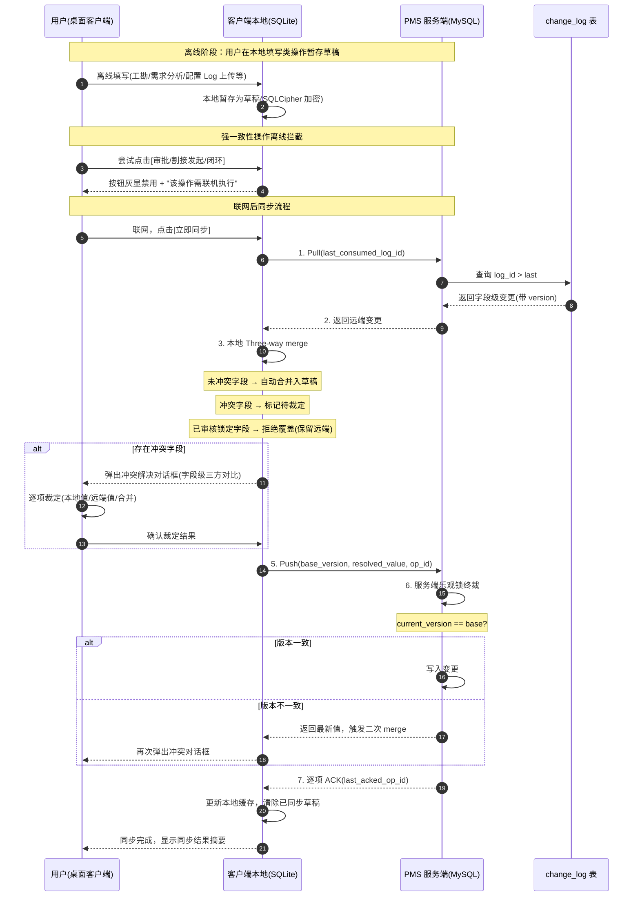
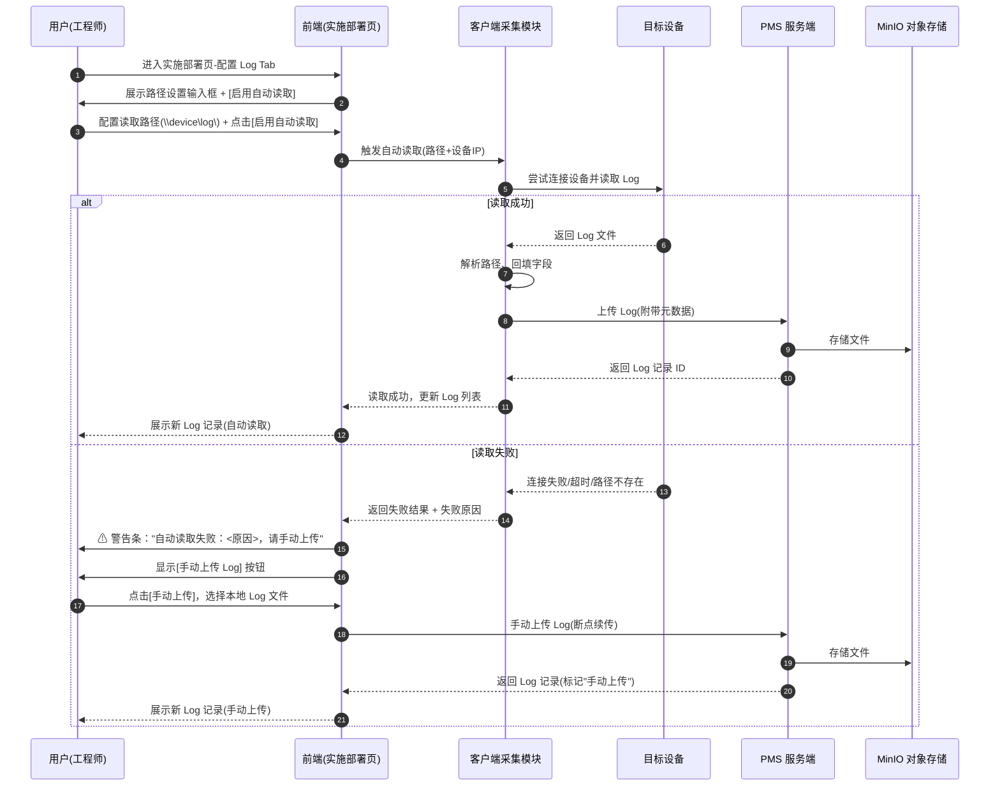
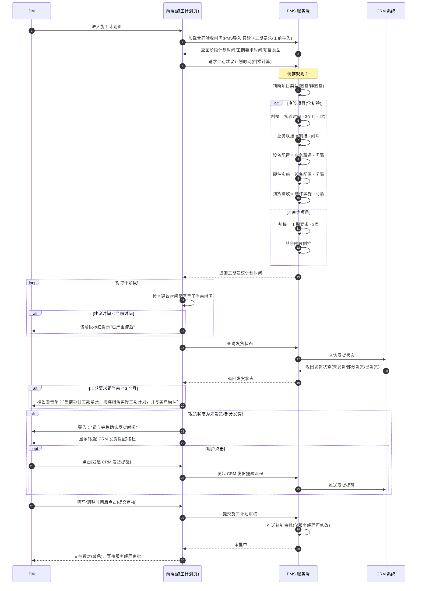
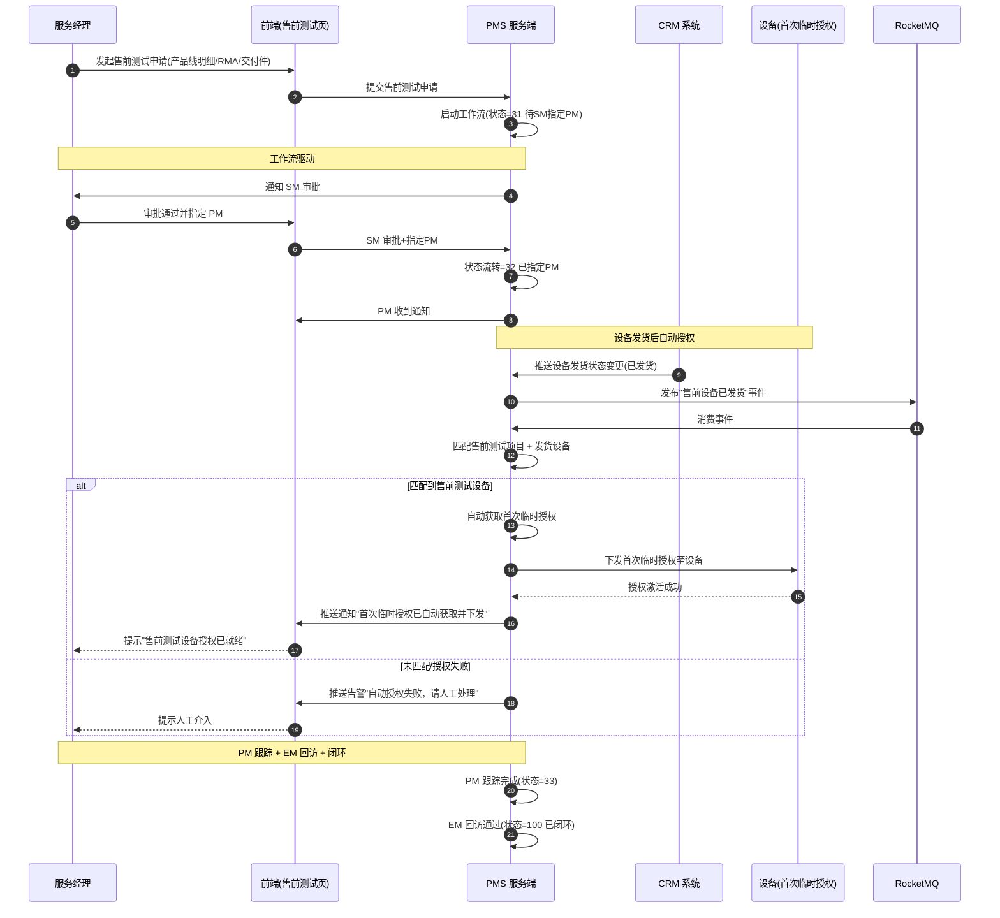
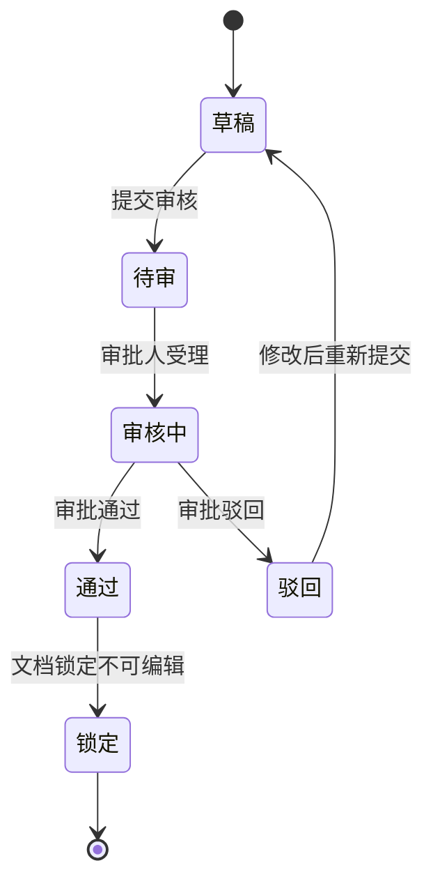

# PMS 项目交付管理系统 - 前端界面设计文档（UI 契约）

**Feature Branch**: `005-pms-consolidated-v2`
**Date**: 2026-07-10
**Status**: Draft（Phase 1 UI 契约补充设计）

**关联文档**：
- 规格说明：[spec.md](./spec.md)
- 实施计划：[plan.md](./plan.md)
- 数据模型：[data-model.md](./data-model.md)
- 契约目录：[contracts/](./contracts/)
  - [桌面客户端离线同步协议](./contracts/desktop-sync.md)
  - [REST API 契约](./contracts/rest-api.md)
  - [事件契约](./contracts/events.md)
  - [外部集成契约](./contracts/external-integrations.md)
- 研究文档：[research.md](./research.md)

**技术栈**：Vue 3.4 + Element Plus 2.x（PC Web / 桌面客户端）+ Vant 4（H5）+ Electron 28+（桌面客户端）
**终端范围**：PC Web / 桌面客户端 / 工程师 H5 / 代理商 H5 / 客户 H5
**设计范围**：覆盖 17 User Stories、139 FR、38 实体、34 Edge Cases

---

## 目录

- [1. 设计原则](#1-设计原则)
- [2. 全局布局](#2-全局布局)
- [3. 5 类终端界面差异对比](#3-5-类终端界面差异对比)
- [4. 核心页面线框图](#4-核心页面线框图)
- [5. 关键交互流程图](#5-关键交互流程图)
- [6. 组件设计规范](#6-组件设计规范)
- [7. 状态视觉规范](#7-状态视觉规范)

---

## 1. 设计原则

### 1.1 信息架构

PMS 以"项目交付生命周期"为唯一主线组织信息架构，避免按老系统模块堆砌菜单。顶层导航按业务域聚合：

```
PMS 原厂交付体系中枢
├── 交付跟踪（主干）
│   ├── 项目总体跟踪          ← 管控中枢入口
│   ├── 售前测试管理
│   └── 项目转包（代施）
├── 交付执行（按生命周期阶段）
│   ├── 工前准备
│   ├── 施工计划
│   ├── 实施方案
│   ├── 实施部署
│   ├── 验收交维
│   └── 割接管理
├── 交付支撑
│   ├── 客户资产库
│   ├── 技术公告与周报
│   ├── 回访与维保
│   ├── AI 排障与知识库
│   └── ITR 故障与 RMA
├── 集成与报表
│   ├── 服务平台集成
│   └── 报表中心
└── 系统管理
    ├── 用户/角色/部门
    ├── 基础数据
    └── 工作流管理
```

**信息架构原则**：
- 主干优先：所有业务功能最终服务于"项目交付"，导航层级不超过 3 级即可触达目标页面。
- 上下文延续：单项目跟踪页采用"左侧阶段导航 + 右侧内容"布局，阶段间数据自动引用（实施方案引用工前/施工计划数据）。
- 状态驱动：阶段卡片、状态标签、超期标红构成全局状态感知体系，管理者一眼掌握风险。
- 横切独立：客户资产库、系统管理、报表、集成作为横切模块独立成域，不嵌入具体阶段。

### 1.2 视觉风格

| 维度 | 规范 | 说明 |
|------|------|------|
| 整体调性 | 专业、严谨、信息密度适中 | 原厂交付体系中枢定位，避免花哨装饰 |
| 信息密度 | 中高密度（表格为主，卡片为辅） | 管理类页面高密度，执行类页面中密度 |
| 留白 | 紧凑但不拥挤，模块间距 16px | 避免空旷感，提升单屏信息量 |
| 图标 | 线性图标（Element Plus / Vant 内置优先） | 状态用色块标签，操作用线性图标 |
| 阴影 | 轻阴影（0 2px 8px rgba(0,0,0,0.08)） | 卡片悬浮、弹窗使用，避免深阴影 |
| 圆角 | 4px（按钮/输入）/ 8px（卡片/弹窗） | 统一圆角，避免过大圆角显得幼稚 |
| 数据可视化 | ECharts，配色与状态色一致 | 报表/统计卡片使用 |

### 1.3 响应式策略

| 终端 | 断点 | 布局策略 |
|------|------|----------|
| PC Web | ≥1280px 标准 / ≥1600px 宽屏 | 固定 Sidebar + 多列表格，宽屏展开更多列 |
| PC Web | 1024-1280px | Sidebar 可折叠，表格出现横向滚动 |
| 桌面客户端 | 跟随窗口尺寸 | 复用 PC Web 布局，最小窗口 1024×680，离线模式新增状态指示器 |
| 工程师 H5 | ≥375px | 单列布局，底部 Tab Bar，顶部返回导航 |
| 代理商 H5 | ≥375px | 单列布局，权限受限的功能集 |
| 客户 H5 | ≥375px | 极简单页，签字板为核心交互 |

**移动端适配优先级**：先保证核心操作（签到/上报/签字/查看任务），复杂编辑引导至 PC。

### 1.4 配色规范

| 色彩角色 | 色值 | Hex | 用途 |
|----------|------|-----|------|
| 主色（品牌） | 深蓝 | `#1A6FD4` | Logo / 主按钮 / 选中态 / 链接 |
| 主色悬浮 | 中蓝 | `#3B8AE0` | 主按钮 hover |
| 主色浅底 | 极浅蓝 | `#E8F2FC` | 选中行底色 / 信息提示条底 |
| 辅色 | 青蓝 | `#0E7C9B` | 次级强调 / 图表辅色 |
| 辅色 | 灰蓝 | `#5A6477` | 次级文本 / 边框 |
| 正常态（成功/已闭环） | 绿 | `#27AE60` | 100 已闭环 / 通过 / 同步成功 |
| 进行中态 | 蓝 | `#2E8BE6` | 32/40 实施中 / 同步中 |
| 警告态（进行中超期临界） | 橙 | `#F39C12` | 工期紧张 / 待审 / 同步中 |
| 超期态（严重） | 红 | `#E74C3C` | 超期标红 / 已严重滞后 / A 类割接 |
| 锁定态 | 紫 | `#8E44AD` | 已审核文档锁定 / 字段锁定 |
| 禁用态 | 灰 | `#BDBDBD` | 离线禁用按钮灰显 / 不可点击 |
| 背景底 | 浅灰 | `#F5F7FA` | 页面背景 |
| 文字主色 | 深灰 | `#303133` | 正文 |
| 文字次色 | 中灰 | `#909399` | 辅助说明 |

**配色一致性原则**：状态色全局统一映射业务语义，同一状态在不同页面颜色一致，不混用。

### 1.5 字体规范

| 层级 | PC Web / 桌面客户端 | H5 移动端 | 用途 |
|------|---------------------|-----------|------|
| 字体族 | `"PingFang SC", "Microsoft YaHei", "Helvetica Neue", Arial, sans-serif` | 系统默认中文字体 | 全局 |
| 字号 H1 | 24px / 600 | 20px / 600 | 页面主标题 |
| 字号 H2 | 20px / 600 | 18px / 600 | 区块标题 |
| 字号 H3 | 16px / 600 | 16px / 600 | 卡片标题 |
| 正文 | 14px / 400 | 14px / 400 | 表格、表单、说明 |
| 辅助文本 | 12px / 400 | 12px / 400 | 标签、提示、时间戳 |
| 数字（统计） | 28px / 600 | 24px / 600 | 阶段卡片数字 |
| 行高 | 1.5 | 1.5 | 全局 |

### 1.6 国际化策略（中英文）

| 维度 | 策略 |
|------|------|
| 文案库 | vue-i18n 9.x，locale 目录 `zh-CN` / `en-US`，key 统一 `page.module.field` |
| 默认语言 | zh-CN（业务系统主语种） |
| 切换 | 用户菜单内切换，记忆至 localStorage |
| 数据双语 | 字典/枚举值中英双字段（如 `status_code` + `status_name_zh` + `status_name_en`），按当前 locale 展示 |
| 日期格式 | zh-CN：`YYYY-MM-DD HH:mm`；en-US：`MM/DD/YYYY HH:mm` |
| 数字 | 千分位、货币（CNY/USD）按 locale |
| 排版方向 | 仅 LTR，暂不支持 RTL |
| 后端契约 | 文案 key 由前端维护，后端返回 code，前端按 locale 映射；枚举 code 不翻译 |

---

## 2. 全局布局

### 2.1 PC Web / 桌面客户端共享布局

PC Web 与桌面客户端共享同一 Vue 应用，布局结构一致。桌面客户端额外在 Header 增加"离线状态指示器"。

```
┌──────────────────────────────────────────────────────────────────────────────┐
│ [Logo] PMS 项目交付管理系统   [全局搜索……]      [🔔3] [👤张三▾] [●在线] │ Header (60px)
├────────┬─────────────────────────────────────────────────────────────────────┤
│        │ [项目总体跟踪] [单项目跟踪] [割接管理×] [+]            > 交付跟踪  │ TagsView (36px)
│ 交付   ├─────────────────────────────────────────────────────────────────────┤
│ 跟踪 ▸ │  面包屑：交付跟踪 / 项目总体跟踪                                     │ Breadcrumb (32px)
│ 交付 ▸ │─────────────────────────────────────────────────────────────────── │
│ 执行 ▸ │                                                                     │
│ 交付 ▸ │                                                                     │
│ 支撑 ▸ │              主内容区（Content）                                    │
│ 集成 ▸ │                                                                     │
│ 系统 ▸ │                                                                     │
│ 管理   │                                                                     │
│        │                                                                     │
│ [◀折叠]│                                                                     │
└────────┴─────────────────────────────────────────────────────────────────────┘
│  Sidebar (208px/64px)        Content (自适应)                                │
└──────────────────────────────────────────────────────────────────────────────┘
```

**Header 区域组成**：
- Logo + 系统名称（点击回首页）
- 全局搜索框（支持办事处/项目名称/合同号/项目级别/客户单位，对应 FR-011）
- 通知中心（铃铛 + 未读数，审批/超期/同步冲突/钉钉回调通知）
- 用户菜单（姓名/角色/部门 + 切换语言 + 修改密码 + 退出）
- 桌面客户端离线状态指示器（仅桌面客户端显示，详见第 4.10 节）

**Sidebar 区域**：
- 按业务域聚合的二级菜单，可折叠（208px ↔ 64px 图标态）
- 当前选中菜单高亮，父级展开指示
- 折叠按钮置于底部

**TagsView**：
- 多页签切换，支持关闭/关闭其他/全部关闭
- 右键菜单操作

**Breadcrumb**：跟随路由自动生成，最后一级不可点击。

**Content**：主内容区，根据路由渲染对应页面，内部 max-width 1440px 居中。

### 2.2 移动端 H5 布局

```
┌──────────────────────────┐
│ [←] 工作台      [☰]    │ 顶部导航 (44px)
├──────────────────────────┤
│                          │
│                          │
│      内容区              │
│                          │
│                          │
│                          │
├──────────────────────────┤
│ [首页] [任务] [上报] [我] │ 底部 Tab Bar (50px)
└──────────────────────────┘
```

**移动端布局规则**：
- 顶部导航：返回按钮 + 页面标题 + 右侧操作（筛选/更多）
- 内容区：单列卡片流，避免横向滚动
- 底部 Tab Bar：4 个一级入口（首页/任务/上报/我的），未登录不显示
- 客户端 H5（无登录态的签核页）不显示 Tab Bar，仅顶部导航 + 内容

---

## 3. 5 类终端界面差异对比

| 对比维度 | PC Web | 桌面客户端 | 工程师 H5 | 代理商 H5 | 客户 H5 |
|----------|--------|------------|-----------|-----------|---------|
| **屏幕尺寸** | ≥1280px，多列布局 | 跟随窗口，最小 1024×680 | 375px+ 单列 | 375px+ 单列 | 375px+ 单列 |
| **技术栈** | Vue3 + Element Plus | Electron 内嵌 PC Web | Vue3 + Vant 4 | Vue3 + Vant 4 | Vue3 + Vant 4 |
| **核心功能范围** | 全功能（17 US） | 全功能 + 离线模式 | 现场施工子集（签到/工勘/上报/Log 采集/割接辅助） | 转包执行子集（任务接收/付款/回访） | 培训签核/满意度评价（极简） |
| **离线能力** | 无（依赖网络） | 强（本地 SQLite + 字段级合并，7 天缓存） | 弱（只读参考数据 + 现场采集暂存，FR-123） | 无 | 无 |
| **认证方式** | LDAP/AD 在线 | LDAP/AD 在线 + 离线令牌校验（FR-119c） | JWT 在线 | JWT 在线 | 短链/短信免登 token |
| **强一致性写操作** | 全部可用 | 在线可用，离线禁用灰显（FR-119b/Edge Case） | 联机执行，离线禁用 | 联机执行 | 无写操作（仅签字回传） |
| **关键交互** | 鼠标 + 键盘，表格/表单/树/拖拽 | 同 PC Web + 离线同步/冲突解决对话框 | 触摸，卡片流 + 签到 + 拍照 | 触摸，表单 + 状态查看 | 触摸，签字板 + 评价 |
| **通知方式** | 站内 + 浏览器通知 | 站内 + 系统托盘通知 | 站内 + 微信/钉钉推送 | 站内 + 钉钉推送 | 短信短链 |
| **数据同步** | 实时 | Pull-Push 字段级合并（FR-119a） | 联网自动同步 | 实时 | 提交即上传 |
| **核心入口** | 总体跟踪页 | 总体跟踪页（离线可看缓存项目） | 工作台首页 | 任务列表 | 签核单页 |
| **权限模型** | RBAC + 数据权限（办事处/项目归属） | 同 PC + 客户资产库分级（FR-079） | 按所属项目过滤 | 按转包任务过滤 | 仅本人相关单据 |
| **典型用户** | SM/PM/EM/管理员/主任 | 现场项目经理/工程师 | 现场工程师 | 代理商工程师/服务商 | 客户联系人 |

---

## 4. 核心页面线框图

### 4.1 登录页

> **关联**：User Story 6（系统管理与权限控制）/ FR-119c（桌面客户端离线令牌校验）

```
┌──────────────────────────────────────────────────────────────────────────────┐
│                                                                              │
│                                                                              │
│                    ┌─────────────────────────────────┐                       │
│                    │                                 │                       │
│                    │         [PMS Logo]              │                       │
│                    │    PMS 项目交付管理系统         │                       │
│                    │    原厂交付体系中枢             │                       │
│                    │                                 │                       │
│                    │  ┌───────────────────────────┐  │                       │
│                    │  │ 👤 用户名 / 工号           │  │                       │
│                    │  └───────────────────────────┘  │                       │
│                    │  ┌───────────────────────────┐  │                       │
│                    │  │ 🔒 密码                    │  │                       │
│                    │  └───────────────────────────┘  │                       │
│                    │                                 │                       │
│                    │  认证方式：(●) LDAP/AD  ( ) 本地 │                       │
│                    │  记住我 ☐     忘记密码？         │                       │
│                    │                                 │                       │
│                    │  ┌───────────────────────────┐  │                       │
│                    │  │          登  录            │  │                       │
│                    │  └───────────────────────────┘  │                       │
│                    │                                 │                       │
│                    │  © 2026 PMS  v2.0               │                       │
│                    └─────────────────────────────────┘                       │
│                                                                              │
│              [桌面客户端特有：离线令牌校验状态]                               │
│              ● 在线令牌有效  /  ⚠ 离线令牌已过期，请联网重新登录             │
│                                                                              │
└──────────────────────────────────────────────────────────────────────────────┘
```

**关键区域与交互**：
- 登录表单：用户名/工号 + 密码，认证方式默认 LDAP/AD
- 桌面客户端启动时先校验离线令牌：令牌有效→进入离线模式；令牌过期→阻止访问本地缓存，提示联网登录（Edge Case：账户变更后本地缓存不可用）
- 登录失败：错误信息红色提示于表单下方
- 键盘 Enter 提交

### 4.2 项目总体跟踪页

> **关联**：User Story 1 / FR-011、FR-012、FR-013 / Edge Case：超期标红、主页单独体现

```
┌──────────────────────────────────────────────────────────────────────────────┐
│ 交付跟踪 / 项目总体跟踪                                          [导出] [刷新] │
├──────────────────────────────────────────────────────────────────────────────┤
│ ┌────────┐┌────────┐┌────────┐┌────────┐┌────────┐┌────────┐┌────────┐┌─────┐│
│ │  全部  ││ 未开始 ││ 工前   ││ 制定   ││ 编写   ││ 实施   ││ 验收  ││ 超期 ││
│ │        ││        ││ 准备   ││ 施工   ││ 实施   ││ 部署   ││ 交维  ││ 项目 ││
│ │  128   ││   12   ││  18    ││ 计划 9 ││ 方案 15││  40    ││  22   ││  12  ││
│ │        ││        ││        ││        ││        ││        ││       ││🔴标红││
│ └────────┘└────────┘└────────┘└────────┘└────────┘└────────┘└────────┘└─────┘│
│   (点击卡片弹出对应阶段项目列表，卡片为超链接)                                │
├──────────────────────────────────────────────────────────────────────────────┤
│ 搜索：[办事处▾][项目名称……][合同号……][项目级别▾][客户单位……]    [查询][重置]│
├──────────────────────────────────────────────────────────────────────────────┤
│ 办事处  │ 项目名称        │ 合同号    │ 级别 │ 客户单位        │ 阶段      │PM  │操作│
├─────────┼────────────────┼───────────┼──────┼─────────────────┼───────────┼────┼───┤
│ 华东    │ XX银行核心网    │ HT202601  │ A级  │→XX银行(超链接)  │ 40 实施中  │张三│跟踪│
│ 华南    │ YY公司扩容      │ HT202602  │ B级  │→YY公司          │ 验收交维   │李四│跟踪│
│ 华北    │ ZZ项目          │ HT202603  │ A级  │→ZZ集团          │🔴超期     │王五│跟踪│
│ ...     │ ...             │ ...       │ ...  │ ...             │ ...       │... │... │
├──────────────────────────────────────────────────────────────────────────────┤
│                                              共 128 条  < 1 2 3 ... 13 >     │
└──────────────────────────────────────────────────────────────────────────────┘
```

**关键区域与交互**：
- **8 阶段统计卡片**（FR-011）：全部/未开始/工前准备/制定施工计划/编写实施方案/实施部署/验收交维/超期项目，数字为超链接，点击弹出该阶段项目列表抽屉
- **超期项目卡片**（FR-013）：红色高亮，主页单独体现
- **搜索框**（FR-011）：5 维度（办事处/项目名称/合同号/项目级别/客户单位）快速搜索，响应 ≤2 秒（SC-005）
- **项目列表表格**（FR-012）：客户单位字段为超链接→跳转客户资产库页（4.9 节）；阶段字段超期标红；操作按钮→单项目跟踪页
- **超期行**：整行阶段文字标红 `#E74C3C`，并在行首加红色圆点标识
- 支持列配置、导出 Excel

### 4.3 单项目跟踪页

> **关联**：User Story 1 / FR-014、FR-015、FR-016、FR-017、FR-024、FR-025 / Edge Case：主子项目闭环前置

```
┌──────────────────────────────────────────────────────────────────────────────┐
│ 交付跟踪 / 单项目跟踪 / XX银行核心网项目                         [更多操作▾] │
├──────────────────────────────────────────────────────────────────────────────┤
│ ┌─ 项目基础信息 ─────────────────────────────────────────────────────────┐  │
│ │ 项目名称：XX银行核心网    合同号：HT202601   办事处：华东             │  │
│ │ 项目级别：A级            项目类型：标准实施  实施方式：自施            │  │
│ │ 服务经理：赵经理         项目经理：张三       销售：钱七               │  │
│ │ 客户主联系人：孙主管 138xxxx               下单代理商：—              │  │
│ │ 项目阶段：[40 实施中]                       发货状态：部分发货         │  │
│ │ ─ 主子项目 ─ 主项目 ▾  └ 华东子项目 └ 华南子项目(未闭环🔴)           │  │
│ └───────────────────────────────────────────────────────────────────────┘  │
├──────────────────────────────────────────────────────────────────────────────┤
│ ┌─ 顶层生命周期状态机 ───────────────────────────────────────────────────┐  │
│ │  (30)已创建 ──→ (31)待指派PM ──→ (32)已指派PM ──→ [40 实施中] ──→ (100)│  │
│ │    ●已完成        ●已完成          ●已完成        ●当前      ○未到达   │  │
│ │                                                                        │  │
│ │  ┌─ 40 实施中：交付子阶段进度条 ─────────────────────────────────┐    │  │
│ │  │ 未开始 ▸ 工前准备 ▸ 制定施工计划 ▸ 编写实施方案 ▸ 实施部署 ▸ 验收│    │  │
│ │  │  ✓        ✓         ●当前(进行中)   ○           ○         ○    │    │  │
│ │  │  绿色      绿色      蓝色进度条       灰色        灰色      灰色   │    │  │
│ │  └─────────────────────────────────────────────────────────────────┘    │  │
│ └───────────────────────────────────────────────────────────────────────┘  │
├──────────────────────────────────────────────────────────────────────────────┤
│ ┌──────────────┐ ┌──────────────────────────────────────────────────────┐   │
│ │ 基本信息    │ │  当前阶段内容：制定施工计划                            │   │
│ │ 工前准备    │ │  ┌────────────────────────────────────────────────┐  │   │
│ │制定施工计划▸│ │  │ （渲染对应阶段页面，见 4.5 施工计划页）         │  │   │
│ │ 实施方案    │ │  │                                                │  │   │
│ │ 实施部署    │ │  │                                                │  │   │
│ │ 验收交维    │ │  └────────────────────────────────────────────────┘  │   │
│ │  ─ 子阶段 ─  │ │                                                      │   │
│ │ 割接管理    │ │                                                      │   │
│ │ 归档        │ │                                                      │   │
│ └──────────────┘ └──────────────────────────────────────────────────────┘   │
├──────────────────────────────────────────────────────────────────────────────┤
│ 快捷操作：[发起闭环] [发起割接] [创建周报] [发起回访] [查看交付件]           │
│            （主项目存在未闭环子项目时"发起闭环"禁用并提示清单）              │
└──────────────────────────────────────────────────────────────────────────────┘
```

**关键区域与交互**：
- **左侧 2 级导航**（FR-014）：1 级为项目阶段（基本信息/工前准备/制定施工计划/实施方案/实施部署/验收交维），仅展开折叠不可点击；2 级为该阶段具体事项，可点击跳转
- **双层状态机可视化**（FR-002）：顶层生命周期 30→31→32→40→100，当前节点高亮，已完成节点绿色，未到达灰色；40 实施中内嵌套交付子阶段进度条
- **交付子阶段进度条**：未开始/工前准备/制定施工计划/编写实施方案/实施部署/验收交维，已完成✓绿色，当前蓝色进度条，未开始灰色；超期节点红色
- **主子项目关系**（FR-024/FR-025）：主项目下挂子项目列表，未闭环子项目红色标识；主项目发起闭环时校验子项目全部闭环（Edge Case），否则禁用并提示清单
- **快捷操作**：闭环/割接/周报/回访/交付件，按钮根据权限与状态启用/禁用

### 4.4 工前准备页

> **关联**：User Story 4 / FR-026、FR-027、FR-028、FR-029、FR-030、FR-031

```
┌──────────────────────────────────────────────────────────────────────────────┐
│ 单项目跟踪 / 工前准备                                                       │
├──────────────────────────────────────────────────────────────────────────────┤
│ [客户联系人] [工勘分工确认] [需求分析] [物料选择]          [工程交底书 ⬇下载]│
├──────────────────────────────────────────────────────────────────────────────┤
│ ▸ Tab：客户联系人（项目页仅显示主联系人，其他联系人在详情页）                │
│ ┌────────────────────────────────────────────────────────────────────────┐  │
│ │ 主联系人（项目页展示）                                                 │  │
│ │  姓名：孙主管    电话：138xxxx   服务等级：A   部门：IT部  职务：主管   │  │
│ │  [编辑]                                                                │  │
│ │                                                                        │  │
│ │ 其他联系人（详情页展示）                              [+新增联系人]   │  │
│ │ ┌──────────┬──────────┬──────────┬──────────┬──────────┬──────────┐  │  │
│ │ │ 姓名     │ 电话     │ 服务等级 │ 部门     │ 职务     │ 操作     │  │  │
│ │ ├──────────┼──────────┼──────────┼──────────┼──────────┼──────────┤  │  │
│ │ │ 周八     │ 139xxxx  │ A        │ 运维部   │ 工程师   │编辑│失效 │  │  │
│ │ │ 吴九     │ 137xxxx  │ B        │ 网络部   │ 主管     │编辑│失效 │  │  │
│ │ └──────────┴──────────┴──────────┴──────────┴──────────┴──────────┘  │  │
│ └────────────────────────────────────────────────────────────────────────┘  │
├──────────────────────────────────────────────────────────────────────────────┤
│ ▸ Tab：工勘分工确认                                                          │
│  工期要求（项目结束时间）：[2026-09-30]    机房供电确认：[已确认 ▾]          │
│  供电方式：[●]市电 ( )UPS    网口类型：[10G光口▾]                            │
│  机柜资源：[充足] 光纤网线：[需补充] 光模块：[原厂]  原厂光模块：[需采购]    │
│  上架加电需原厂实施：[是▾] → 需要外包：[是] → 显示 [发起外包流程] 链接       │
│  导轨托盘需求：[是] → 显示 [物料领用] [外采] 链接                           │
│  发货物料符合性：[不符合] → 进入 [物料选择] 独立页面（非弹窗）               │
├──────────────────────────────────────────────────────────────────────────────┤
│ ▸ Tab：需求分析                                                              │
│  项目背景：[文本域……]            项目目标：[文本域……]                      │
│  网络拓扑：[📎上传文件]            传输现状：[☐IPv6 ☐分片 ☐MTU ☐Jumbo ☐隧道]│
│  流量现状：新建[ ] 并发[ ] 吞吐[ ]  IP资源：管理IP[ ] 公网IP[ ]             │
│  冗余备份要求：[文本……]           运维管理要求：[☐带内 ☐带外 ☐SNMP ☐UMC …]│
├──────────────────────────────────────────────────────────────────────────────┤
│ ▸ Tab：物料选择（独立页面，非弹窗，FR-029）                                  │
│  ☐ │ 序列号     │ 产品编码  │ 产品名称  │ 不符合项说明      │ 换货流程    │
│  ☐ │ SN001      │ P001     │ 设备A     │ [输入说明]        │ [发起换货] │
│  ☑ │ SN002      │ P002     │ 设备B     │ 接口不匹配        │ [发起换货] │
│  勾选需换货物料 + 填写说明 → [发起换货流程] 推送 CRM（失败不阻塞，提示原因）│
└──────────────────────────────────────────────────────────────────────────────┘
```

**关键区域与交互**：
- **4 个 Tab**：客户联系人/工勘分工确认/需求分析/物料选择（物料选择为独立页面超链接进入，FR-028/FR-029）
- **客户联系人**（FR-026）：主联系人在项目页，其他联系人仅在详情页；姓名模糊匹配（我司匹配 PMS，客户匹配客户联系人）
- **工勘条件分支**（FR-027/FR-028）：上架加电需外包→显示发起外包链接；导轨托盘需求→显示物料领用/外采链接；物料不符合→进入物料选择独立页
- **工程交底书下载**（FR-031）：根据发货设备自动生成，提供下载按钮
- **物料换货推 CRM 失败**（Edge Case）：不阻塞操作，仅提示失败原因

### 4.5 施工计划页

> **关联**：User Story 7 / FR-032、FR-033、FR-034、FR-035、FR-036 / Edge Case：工期倒推、紧张提醒、严重滞后标红

```
┌──────────────────────────────────────────────────────────────────────────────┐
│ 单项目跟踪 / 制定施工计划                                                   │
├──────────────────────────────────────────────────────────────────────────────┤
│ ⚠ 当前项目工期紧张，请详细落实好工期计划，并与客户确认                      │
│ ⚠ 发货状态：部分发货 → 请与销售确认发货时间    [发起 CRM 发货提醒]          │
├──────────────────────────────────────────────────────────────────────────────┤
│ 合同验收时间（PMS 导入，只读）：2026-09-30      工期要求（工前带入）：2026-09│
│ 项目类型：[●]直签（含初验） ( )非直签                                        │
├──────────────────────────────────────────────────────────────────────────────┤
│ ┌─ 三层时间模型 ────────────────────────────────────────────────────────┐ │
│ │ 阶段        │ 阶段计划时间 │ 工期要求时间 │ 工期建议计划时间(倒推) │ 备注│ │
│ ├─────────────┼──────────────┼──────────────┼───────────────────────┼─────┤ │
│ │ 到货签收    │ 2026-07-15   │ 2026-07-20   │ 2026-07-18             │ 必填│ │
│ │ 硬件实施    │ 2026-07-25   │ 2026-07-30   │ 2026-07-28             │     │ │
│ │ 设备配置    │ 2026-08-05   │ 2026-08-10   │ 2026-08-08             │     │ │
│ │ 业务联通    │ 2026-08-15   │ 2026-08-20   │ 2026-08-18             │     │ │
│ │ 割接-上线   │ 2026-09-05   │ 2026-09-10   │🔴2026-07-01(已严重滞后)│ 提示│ │
│ │ 初验(直签)  │ 2026-09-20   │ 2026-09-25   │ 2026-09-22             │ 必填│ │
│ │ 终验(直签)  │ 2026-09-28   │ 2026-09-30   │ 2026-09-28             │ 必填│ │
│ └─────────────┴──────────────┴──────────────┴───────────────────────┴─────┘ │
│  倒推规则：直签项目 割接=初验-3个月-2周；非直签项目 割接=工期-2周           │
├──────────────────────────────────────────────────────────────────────────────┤
│                                              [保存草稿]  [提交审核(钉钉审批)]│
└──────────────────────────────────────────────────────────────────────────────┘
```

**关键区域与交互**：
- **三层时间模型**（FR-032）：阶段计划时间/工期要求时间/工期建议计划时间（倒推自动计算），分列展示便于对比
- **工期紧张提醒条**（FR-035）：橙色警告条，工期要求离当前不足 3 个月时提示
- **CRM 发货提醒**（FR-035）：发货状态未发货/部分发货时提供发起 CRM 发货提醒流程选项
- **严重滞后标红**（Edge Case）：工期建议时间早于当前时间标红提示"已严重滞后"
- **直签项目必填项**（FR-034）：到货签收/初验/终验必填
- **提交审核**（FR-036）：推服务经理钉钉审批，仅服务经理可修改计划；已提交审核后文档锁定（紫色标识）

### 4.6 实施方案页

> **关联**：User Story 8 / FR-037、FR-038、FR-039、FR-040、FR-041

```
┌──────────────────────────────────────────────────────────────────────────────┐
│ 单项目跟踪 / 实施方案                                              [已审核锁定🔒]│
├──────────────────────────────────────────────────────────────────────────────┤
│ 是否已有客户方案：(●)是 ( )否   [📎上传方案文件]  [提交系统判断→自动填充]   │
├──────────────┬──────────────────────────────────────────────────────────────┤
│ 章节目录树    │  当前章节：3. 总体方案设计                                   │
│              │  ┌────────────────────────────────────────────────────────┐  │
│ 1.项目概述   │  │ 3.1 设备部署位置规划          [引用工勘/需求分析]    │  │
│ 2.现网现状   │  │ 3.2 设备接口互联规划                                 │  │
│ 3.总体方案▸ │ │ 3.3 设备 IP 与 VLAN 规划                            │  │
│  3.1 部署   │  │ 3.4 软件版本（同步至序列号模块）                    │  │
│  3.2 接口   │  │                                                      │  │
│  3.3 IP/VLAN│ │  [富文本编辑器]                                       │  │
│  3.4 版本   │  │                                                      │  │
│ 4.配置脚本   │  │                                                      │  │
│ 5.实施步骤   │  │                                                      │  │
│ 6.其他方案▾ │ │  ▸ 质量保障模板      ☑ 已选 → [添加到实施方案]        │  │
│   质量保障  │  │  ▸ 风险管控与应急预案                                │  │
│   风险管控  │  │  ▸ 运维交付与售后                                    │  │
│   运维售后  │  │  ▸ 项目问题闭环与文档归档                            │  │
│ 7.培训移交   │  │                                                      │  │
│ 8.售后服务   │  └────────────────────────────────────────────────────────┘  │
│              │                                                              │
├──────────────┴──────────────────────────────────────────────────────────────┤
│  [保存草稿]  [生成方案]  [⬇下载方案]  [提交审核(服务经理审核，重大→总部复核)]│
└──────────────────────────────────────────────────────────────────────────────┘
```

**关键区域与交互**：
- **左侧 8 章节目录树**：1 项目概述/2 现网现状/3 总体方案设计/4 配置脚本/5 实施步骤/6 其他方案模板/7 培训资料移交/8 售后服务
- **已有客户方案上传**（FR-037）：选择"是"→上传文件→"提交系统判断"→自动填充至下方表单
- **前序数据引用**（FR-038）：自动引用工前准备的项目背景/目标、团队成员、产品清单、施工计划、工勘、需求分析
- **其他方案模板**（FR-040）：质量保障/风险管控与应急预案/运维交付与售后/项目问题闭环与文档归档，勾选弹出可修改模板→"添加到实施方案"
- **操作按钮**（FR-041）：保存草稿/生成方案/下载方案/提交审核（服务经理审核，重大项目提交总部复核）
- **已审核锁定**（Edge Case）：提交审核后文档锁定，紫色锁标识，不可编辑

### 4.7 实施部署页

> **关联**：User Story 9 / FR-042、FR-043、FR-044、FR-045、FR-046 / Edge Case：配置 Log 读取失败回退

```
┌──────────────────────────────────────────────────────────────────────────────┐
│ 单项目跟踪 / 实施部署                                                       │
├──────────────────────────────────────────────────────────────────────────────┤
│ [到货签收] [硬件安装] [配置 Log] [业务联调] [割接发起]                      │
├──────────────────────────────────────────────────────────────────────────────┤
│ ▸ Tab：配置 Log（FR-044）                                                   │
│  自动读取路径设置：[\\device\log\] [保存路径]   [启用自动读取]              │
│  ┌──────────────────────────────────────────────────────────────────────┐  │
│  │ ⚠ 自动读取失败：无法连接设备(10.0.0.1)，请检查网络或手动上传        │  │
│  │                                                  [手动上传 Log]    │  │
│  └──────────────────────────────────────────────────────────────────────┘  │
│  Log 列表：                                                                 │
│  ┌────────────┬──────────┬──────────┬──────────┬──────────┬──────────────┐ │
│  │ Log 文件名 │ 类型     │ 上传方式 │ 上传人   │ 上传时间 │ 操作         │ │
│  ├────────────┼──────────┼──────────┼──────────┼──────────┼──────────────┤ │
│  │ cfg01.log  │ 配置调试 │ 自动读取 │ 系统     │ 07-10 10:│ [下载]        │ │
│  │ cfg02.log  │ 业务联调 │ 手动上传 │ 张三     │ 07-10 11:│ [下载]        │ │
│  └────────────┴──────────┴──────────┴──────────┴──────────┴──────────────┘ │
├──────────────────────────────────────────────────────────────────────────────┤
│ ▸ Tab：割接发起（FR-046）                                                   │
│  前期流程完成情况：                                                         │
│   ✓ 到货签收已完成   ✓ 硬件安装已完成   ✓ 配置 Log 已上传                  │
│   ✓ 业务联调已完成   割接前置条件：[全部完成]                              │
│  ┌──────────────────────────────────────────────────────────────────────┐  │
│  │ 割接备件库存检查：库存不足 ❌                                          │  │
│  │ ⚠ 备件库存不足，无法发起割接，已触发预警                              │  │
│  │                                        [发起割接](禁用灰显)          │  │
│  └──────────────────────────────────────────────────────────────────────┘  │
│  （前期未完成时"发起流程"按钮失效；备件不足阻断发起并预警）                 │
├──────────────────────────────────────────────────────────────────────────────┤
│ ▸ Tab：业务联调（FR-045）                                                   │
│  设备连接信息：[+新增]   [一键收集配置信息]                                │
│  设备清单：设备型号 │ 序列号(PMS导入) │ 运行业务描述(手动)                  │
└──────────────────────────────────────────────────────────────────────────────┘
```

**关键区域与交互**：
- **5 个 Tab**：到货签收/硬件安装/配置 Log/业务联调/割接发起
- **到货签收**（FR-042）：上传到货签收单文件
- **硬件安装**（FR-043）：序列号、产品名称（PMS 导入）、安装位置（需求分析带入可改）、上传安装照片
- **配置 Log 自动读取**（FR-044）：设置路径→自动读取解析回填；失败时显示失败原因并提供手动上传回退（Edge Case）
- **业务联调一键收集**（FR-045）：采集设备连接信息（IP/用户名/密码/SSH·Telnet·串口/端口/波特率）+ 一键收集配置 + 设备级运行业务记录
- **割接发起按钮**（FR-046）：前期流程未完成失效；备件库存不足阻断发起并触发预警（Edge Case）

### 4.8 割接管理页

> **关联**：User Story 12 / FR-085、FR-086、FR-087、FR-088、FR-089、FR-090

```
┌──────────────────────────────────────────────────────────────────────────────┐
│ 交付执行 / 割接管理                                                         │
├──────────────────────────────────────────────────────────────────────────────┤
│ 割接单列表                                                [+发起割接]        │
│ ┌──────────┬──────────┬──────────┬──────────┬──────────┬──────────────────┐ │
│ │ 割接单号 │ 项目     │ 类型     │ 等级     │ 状态     │ 操作             │ │
│ ├──────────┼──────────┼──────────┼──────────┼──────────┼──────────────────┤ │
│ │ CO001    │ XX银行   │ 友商替换 │🔴A类    │ 待审批   │[详情][操作单]    │ │
│ │ CO002    │ YY公司   │ 补丁升级 │🟠B类    │ 执行中   │[详情][checklist]│ │
│ └──────────┴──────────┴──────────┴──────────┴──────────┴──────────────────┘ │
├──────────────────────────────────────────────────────────────────────────────┤
│ 割接详情 CO001                                                              │
│  来源：[●]工程交付 ( )维保 ( )ITR故障 ( )RMA                                │
│  类型：[友商替换▾]（7种：友商替换/新建入网/搬迁/配置变更/补丁/版本/RMA）    │
│  等级：🔴 A类（自动评定，固定规则匹配）→ 分级审批：服务经理+二线+研发      │
│        🟠 B类 → 服务经理+二线；外部客户割接需上传客户审批确认单            │
├──────────────────────────────────────────────────────────────────────────────┤
│ ┌─ 割接方案（模板生成）──────────────────────────────────────────────────┐ │
│ │ ▸ 操作前/中步骤规划及窗口设计   ▸ 设备验证 ▸ 业务验证 ▸ 目标验证      │ │
│ │ ▸ 回退规划 ▸ 割接保障规划                                            │ │
│ │ 工具集风险确认：[配置对比][配置翻译][脚本制作/验证][拓扑生成]          │ │
│ │              [业务指标判定] → 风险确认状态：✓已确认                   │ │
│ └─────────────────────────────────────────────────────────────────────────┘ │
├──────────────────────────────────────────────────────────────────────────────┤
│ ┌─ 操作单 / checklist ─────────────────────────────────────────────────────┐│
│ │ 割接准备：[☐]步骤1 [☐]步骤2 [☐]步骤3 ...                              ││
│ │ 割接：    [☐]步骤1 [☐]步骤2 ...                                       ││
│ │ 割接后：  [☐]步骤1 [☐]步骤2 ...                                       ││
│ │ 回退：    [☐]步骤1 [☐]步骤2 ...                                       ││
│ └─────────────────────────────────────────────────────────────────────────┘│
├──────────────────────────────────────────────────────────────────────────────┤
│ ┌─ 业务指标判定 ───────────────────────────────────────────────────────────┐│
│ │ 指标项          │ 阈值       │ 实测值     │ 判定                      ││
│ │ 业务连通率      │ ≥99.9%     │ 99.95%     │ ✓通过                    ││
│ │ 设备功能验证    │ 全通过     │ 全通过     │ ✓通过                    ││
│ └─────────────────┴────────────┴────────────┴───────────────────────────────┘│
├──────────────────────────────────────────────────────────────────────────────┤
│ ┌─ 承诺书签字 ─────────────────────────────────────────────────────────────┐│
│ │ 《机房割接实施承诺书》                                                 ││
│ │ 签字人：[手写签字板区域]              签字时间：2026-07-10 15:00        ││
│ │ checklist 核验：✓ 全部通过                                            ││
│ │                                              [闭环归档(刷新PMS)]      ││
│ └─────────────────────────────────────────────────────────────────────────┘│
└──────────────────────────────────────────────────────────────────────────────┘
```

**关键区域与交互**：
- **割接单列表**：来源（工程交付/维保/ITR故障/RMA）+ 类型（7 种）+ 等级（A/B）+ 状态
- **A/B 类等级标识**（FR-086）：A 类红色 `#E74C3C`，B 类橙色 `#F39C12`，自动评定（固定规则）
- **分级审批**（FR-086）：A 类服务经理+二线+研发；B 类服务经理+二线；外部客户割接上传客户审批确认单
- **割接方案模板生成**（FR-087）：操作前/中步骤、设备/业务/目标验证、回退规划、保障规划；工具集（配置对比/配置翻译/脚本制作验证/拓扑生成/方案输出/业务指标判定）完成风险确认
- **操作单/checklist**（FR-088）：割接准备/割接/割接后/回退四组 checklist
- **业务指标判定**（FR-088）：阈值与实测值对比，自动判定通过/不通过
- **承诺书签字**（FR-089）：手写签字板 + checklist 核验，签字后闭环
- **闭环归档**（FR-090）：show tech-support 备份、客户技术档案更新、PMS 刷新版本/CPLD/conboot/备件序列号、推送闭环通知

### 4.9 客户资产库页

> **关联**：User Story 5 / FR-074、FR-075、FR-076、FR-077、FR-078、FR-079、FR-080

```
┌──────────────────────────────────────────────────────────────────────────────┐
│ 客户资产库 / XX银行                                                         │
│ (从项目跟踪页客户单位超链接进入，FR-074)                                    │
├──────────────────────────────────────────────────────────────────────────────┤
│ ┌─ 客户单位信息卡 ──────────────────────────────────────────────────────┐  │
│ │ 客户编码：C001   客户名称：XX银行   行业：金融   地址：……            │  │
│ │ 客户服务等级：[A级 ▾] (可修改，修改后所有关联项目同步，FR-078)       │  │
│ │ 权限提示：您当前角色[服务经理]可全局访问（FR-079 分级控制）          │  │
│ └───────────────────────────────────────────────────────────────────────┘  │
├──────────────────────────────────────────────────────────────────────────────┤
│ [归属项目] [归属设备] [联系人] [服务记录] [故障记录] [续保记录]            │
├──────────────────────────────────────────────────────────────────────────────┤
│ ▸ Tab：归属项目                                                            │
│  ┌──────────┬──────────┬──────────┬──────────┬──────────┬────────────────┐ │
│  │ 项目名称 │ 合同号   │ 项目级别 │ 阶段     │ PM       │ 操作           │ │
│  ├──────────┼──────────┼──────────┼──────────┼──────────┼────────────────┤ │
│  │ 核心网   │ HT202601 │ A级      │ 40实施中 │ 张三     │ [进入跟踪]     │ │
│  └──────────┴──────────┴──────────┴──────────┴──────────┴────────────────┘ │
│ ▸ Tab：归属设备（FR-076）                                                  │
│  序列号 │ 产品型号 │ 安装位置 │ 配置历史[对比] │ 部署风险 │ 接口对照表     │
│  SN001  │ 设备A    │ 机房1    │ [历史对比]      │ 单机风险 │ [查看]         │
│  （设备信息增强：配置历史对比/部署风险/接口对照表/网络拓扑自动生成，FR-099）│
│ ▸ Tab：联系人（FR-075）                                                    │
│  姓名 │ 电话 │ 服务等级 │ 部门 │ 职务 │ 操作                               │
│ ▸ Tab：服务记录（FR-077，一期框架）                                         │
│ ▸ Tab：故障记录（FR-077，一期框架）                                         │
│ ▸ Tab：续保记录（FR-080，MES 只读）                                         │
│  ┌──────────────────────────────────────────────────────────────────────┐  │
│  │ 🔒 本页数据由 MES 集成获取，只读展示，不提供编辑入口                 │  │
│  │ 维保时长 │ 维保起止时间 │ 续保次数 │ ...                              │  │
│  └──────────────────────────────────────────────────────────────────────┘  │
└──────────────────────────────────────────────────────────────────────────────┘
```

**关键区域与交互**：
- **入口**（FR-074）：从项目总体跟踪页客户单位超链接进入；整合性查询页面，不存储独立数据
- **客户单位信息卡**（FR-075）：客户编码/名称/地址/行业（PMS 导入）；服务等级可修改
- **服务等级修改联动**（FR-078）：修改后所有关联项目的联系人服务等级同步生效
- **权限分级**（FR-079）：服务经理全局/交付管理人员按办事处/项目经理按项目归属/其他不可访问
- **归属设备增强**（FR-076/FR-099）：配置历史对比、部署风险、接口对照表、网络拓扑自动生成
- **续保记录 MES 只读**（FR-080）：红色锁标识 + 提示"由 MES 集成获取，只读"

### 4.10 桌面客户端离线模式

> **关联**：User Story 6 / FR-119a/b/c/d / Edge Case：离线同步冲突、强一致性拦截、缓存超期、账户变更

```
┌──────────────────────────────────────────────────────────────────────────────┐
│ [Logo] PMS  [搜索……]   [🔔3] [👤张三▾]  离线状态：[⚠离线-缓存剩余4天12时] │
├────────┬─────────────────────────────────────────────────────────────────────┤
│        │ ⚠ 缓存已过期，请联网刷新（缓存超 7 天，不强制清除，离线填写仍可暂存）│
│ 交付   ├─────────────────────────────────────────────────────────────────────┤
│ 跟踪 ▸ │  当前：离线模式                                                       │
│ 交付 ▸ │  ┌─ 同步队列 ──────────────────────────────────────────────────┐   │
│ 执行 ▸ │  │ 待同步变更：5 条                                              │   │
│ 交付 ▸ │  │  ☐ 工勘记录-字段：供电方式(本地改/远端未变→自动合并)        │   │
│ 支撑 ▸ │  │  ☐ 需求分析-字段：项目背景(本地改/远端改→⚠冲突待裁定)      │   │
│ 集成 ▸ │  │  ☐ 实施部署-配置 Log 上传(待同步)                            │   │
│ 系统 ▸ │  │  ☐ 施工照片(待同步)                                          │   │
│ 管理   │  │                                          [立即同步(需联网)] │   │
│        │  └──────────────────────────────────────────────────────────────┘   │
│ [◀折叠]│                                                                      │
│        │  ┌─ 强一致性操作（离线禁用灰显）────────────────────────────────┐  │
│        │  │ [审批提交] 灰显禁用   [状态流转] 灰显禁用                    │  │
│        │  │ [割接发起] 灰显禁用   [闭环申请] 灰显禁用                    │  │
│        │  │ [转包发起] 灰显禁用                                          │  │
│        │  │ 提示："该操作需联机执行"                                     │  │
│        │  └──────────────────────────────────────────────────────────────┘  │
└────────┴─────────────────────────────────────────────────────────────────────┘

联网后弹出冲突解决对话框：
┌──────────────────────────────────────────────────────────────────┐
│ 同步冲突解决 - 字段级合并                          │
├──────────────────────────────────────────────────────────────────┤
│ 实体：需求分析(项目:XX银行)   字段冲突：1 项                      │
├────────┬──────────────┬──────────────┬──────────────┬───────────┤
│ 字段   │ 基准值(base) │ 本地值(local)│ 远端值(remote│ 处理方式  │
├────────┼──────────────┼──────────────┼──────────────┼───────────┤
│项目背景│ 原始背景…   │ 本地修改…    │ 远端修改…    │(●本地)( )远端│
│        │              │              │              │( )合并    │
├────────┴──────────────┴──────────────┴──────────────┴───────────┤
│ ⚠ 已审核锁定字段（施工计划-到货签收时间）拒绝离线覆盖，保留远端值│
├──────────────────────────────────────────────────────────────────┤
│                              [取消]  [应用裁定并提交]           │
└──────────────────────────────────────────────────────────────────┘
```

**关键区域与交互**：
- **离线状态指示器**（Header）：显示在线/离线/同步中/冲突/缓存超期，缓存剩余天数倒计时
- **缓存过期提示条**（Edge Case FR-119d）：缓存超 7 天显著位置橙色提示"缓存已过期，请联网刷新"，不强制清除
- **同步队列**：列出待同步变更，标注每条字段是"自动合并"还是"冲突待裁定"
- **强一致性操作禁用**（Edge Case FR-119b）：审批/状态流转/割接发起/闭环/转包发起按钮灰显 + "该操作需联机执行"提示
- **冲突解决对话框**（Edge Case FR-119a）：字段级三方对比（基准/本地/远端），逐项选择本地值/远端值/合并；已审核锁定字段拒绝覆盖，保留远端值（紫色锁标识）
- **账户变更校验**（Edge Case FR-119c）：启动时校验 LDAP/AD 登录态失败→阻止访问本地缓存

### 4.11 AI 排障页

> **关联**：User Story 16 / FR-095、FR-096、FR-097、FR-098

```
┌──────────────────────────────────────────────────────────────────────────────┐
│ 交付支撑 / AI 排障与知识库                                                  │
├──────────────────────────────────────────────────────────────────────────────┤
│ ┌─ 工具集选择 ─────────────────────────────────────────────────────────────┐│
│ │ [命令解析][功能配置][日志解析][MIB解析][API解析][场景答疑]              ││
│ │ 场景类型：(●)咨询类 ( )故障类                                          ││
│ └─────────────────────────────────────────────────────────────────────────┘│
├──────────────────────────────────────────────────────────────────────────────┤
│ ┌─ 对话区 ──────────────────────────────────┬─ 知识库引用 ──────────────┐ │
│ │ 用户：设备 show interface 输出异常，请…   │ 📚 引用来源              │ │
│ │                                           │ • 命令行手册 §3.2        │ │
│ │ AI：已调用[命令解析]工具，分析如下：       │ • 日志手册 - 错误码 0x.. │ │
│ │  1. 接口 Gi0/0/1 状态 down                │ • 经典案例 #CASE-0123    │ │
│ │  2. 可能原因：光模块故障/配置错误          │ • FAQ-0045               │ │
│ │  3. 建议排查：show transceiver …          │ • 技术公告 TA-2026-007   │ │
│ │                                           │                          │ │
│ │ 用户：已执行，光模块功率异常              │ [查看完整引用]           │ │
│ │ AI：判定光模块故障，建议更换并关联 RMA…   │                          │ │
│ │  [调用日志解析] [生成排障经验模板]        │                          │ │
│ │                                           │                          │ │
│ │ [输入问题……]                       [发送]│                          │ │
│ └───────────────────────────────────────────┴──────────────────────────┘ │
├──────────────────────────────────────────────────────────────────────────────┤
│ ┌─ 诊断结果 / 经验沉淀 ────────────────────────────────────────────────────┐│
│ │ 排障过程（由现象至结论完整记录）：                                       ││
│ │  现象 → 排查步骤 → 根因 → 处置 → 验证                                  ││
│ │  [保存为排障经验模板]                                                   ││
│ │  模板字段：故障单号/现象/产品架构/触发因素/排查过程                      ││
│ └─────────────────────────────────────────────────────────────────────────┘│
└──────────────────────────────────────────────────────────────────────────────┘
```

**关键区域与交互**：
- **工具集选择**（FR-095）：6 工具集（命令解析/功能配置/日志解析/MIB 解析/API 解析/场景答疑）+ 场景类型（咨询类/故障类）
- **对话区**：对话式界面，AI 调用工具集展示分析过程与建议
- **知识库引用**（FR-096）：右侧展示引用来源（标准手册/命令行手册/典配/日志/Mib/API/技术公告/已知隐患/FAQ/经典案例/排障经验）
- **诊断结果**（FR-098）：排障过程由上而下（现象→结论）完整记录
- **经验沉淀模板**（FR-097）：生成排障经验模板（故障单号/现象/产品架构/触发因素/排查过程），保存至公共 KB

### 4.12 移动端工程师工作台

> **关联**：User Story 9、User Story 3 / FR-123 / Edge Case：移动端离线缓存

```
┌──────────────────────────┐
│ [←] 工作台        [☰]    │
├──────────────────────────┤
│ 欢迎张三 (工程师)         │
│ 今日任务：3  待上报：2    │
│ 离线缓存：●在线           │
├──────────────────────────┤
│ ┌─ 快捷操作 ────────────┐│
│ │ [📍签到]  [📷施工上报]││
│ │ [📋任务]  [📄交付件]  ││
│ └────────────────────────┘│
├──────────────────────────┤
│ ┌─ 今日任务 ────────────┐│
│ │ 1. XX银行-硬件安装    ││
│ │    进行中  [详情>]    ││
│ │ 2. YY公司-配置调试    ││
│ │    待开始  [详情>]    ││
│ │ 3. ZZ项目-割接辅助    ││
│ │    待开始  [详情>]    ││
│ └────────────────────────┘│
├──────────────────────────┤
│ ┌─ 施工上报 ────────────┐│
│ │ 项目：XX银行核心网     ││
│ │ 类型：[配置 Log▾]      ││
│ │ [📷拍照上传]           ││
│ │ [📎选择文件]           ││
│ │ 备注：[……]            ││
│ │ [保存草稿] [提交]     ││
│ │ (离线时暂存，联网同步) ││
│ └────────────────────────┘│
├──────────────────────────┤
│ [首页] [任务] [上报] [我] │
└──────────────────────────┘
```

**关键区域与交互**：
- **签到**：基于定位的现场签到
- **任务列表**：按所属项目过滤，显示状态（进行中/待开始/已完成）
- **施工上报**：拍照上传/文件选择/备注，离线时暂存本地草稿，联网自动同步（FR-123）
- **离线缓存指示**：在线/离线/同步中状态
- **离线范围**（FR-123）：只读参考数据（项目/设备清单/实施方案）+ 现场采集（照片/工勘/Log/签到），审批/状态变更联机执行

### 4.13 移动端客户签核页

> **关联**：User Story 15 / FR-047、FR-048 / Edge Case：客户评价长期未回传

```
┌──────────────────────────┐
│ [←] 服务评价             │
├──────────────────────────┤
│ XX银行 核心网项目         │
│ 培训记录服务评价          │
├──────────────────────────┤
│ 培训工程师：张三          │
│ 培训时间：2026-07-10      │
│ 设备类型：[核心交换机]     │
│ 培训内容：设备基础操作…    │
├──────────────────────────┤
│ 请对本次服务进行评价：    │
│ 工程质量：★★★★★         │
│ 产品质量：★★★★☆         │
│ 服务质量：★★★★★         │
│ 客户反馈意见：            │
│ [文本域……]               │
├──────────────────────────┤
│ ┌─ 手写签字 ────────────┐│
│ │                        ││
│ │   (手写签字板区域)     ││
│ │                        ││
│ │  [清除]  [确认签字]   ││
│ └────────────────────────┘│
├──────────────────────────┤
│ 回传状态：●已回传 07-10   │
│ (超期未回传将提醒工程师)   │
├──────────────────────────┤
│            [提交评价]     │
└──────────────────────────┘
```

**关键区域与交互**：
- **入口**：现场培训记录/满意度调查推送至客户联系人手机，短信短链免登进入
- **培训记录评价**（FR-047）：客户填写意见 + 签字回传→同步至交付件页面可下载
- **满意度调查**（FR-048）：工程质量/产品质量/服务质量多维度评分 + 签字回传→生成满意度调查报告
- **签字板**：手写签字，清除/确认
- **回传状态**：已回传/待回传，超期未回传触发提醒（Edge Case）
- 无 Tab Bar，单页极简

---

## 5. 关键交互流程图

### 5.1 桌面客户端离线同步冲突解决流程

> **关联**：FR-119a / Edge Case：离线同步冲突、强一致性拦截



### 5.2 配置 Log 自动读取失败回退手动上传流程

> **关联**：FR-044 / Edge Case：配置 Log 读取失败回退



### 5.3 工期倒推计算与提醒流程

> **关联**：FR-032、FR-033、FR-035 / Edge Case：工期紧张提醒、严重滞后标红



### 5.4 售前测试设备发货自动授权流程

> **关联**：User Story 2 / FR-053



---

## 6. 组件设计规范

### 6.1 表格组件（PmsTable）

基于 Element Plus `el-table` 封装，新增业务能力。

| 能力 | 说明 | 配置 |
|------|------|------|
| 可编辑单元格 | 双击进入编辑，支持输入/选择/日期 | `editableColumns` + 校验规则 |
| 列配置 | 用户可拖拽调整列顺序、显隐、宽度，记忆 localStorage | `columnConfig` + 拖拽 |
| 导出 | 一键导出当前筛选结果为 Excel（Apache POI 后端生成） | `exportable: true` |
| 超期标红 | 行/单元格根据状态字段标红 | `overdueField` + `overdueColor: #E74C3C` |
| 数据权限过滤 | 后端按办事处/项目归属过滤，前端透传 | 配合 RBAC |
| 分页 | 服务端分页，默认 20/页 | `pagination` |
| 空数据 | 自定义空状态插画 + 提示 | `emptyText` |

```
┌──────────────────────────────────────────────────────────────────┐
│ [列配置⚙] [导出⬇] [刷新🔄]                  搜索：[……] [查询]   │
├────┬──────────┬──────────┬──────────┬──────────┬────────────────┤
│ 🔴│ 办事处   │ 项目名称 │ 客户单位 │ 阶段     │ 操作          │
├────┼──────────┼──────────┼──────────┼──────────┼────────────────┤
│ ● │ 华东     │ XX银行   │→XX银行   │🔴超期    │[详情][编辑]   │
│    │ 华南     │ YY公司   │→YY公司   │ 40实施中 │[详情][编辑]   │
├────┴──────────┴──────────┴──────────┴──────────┴────────────────┤
│                                          共 128 条 < 1 2 3 >    │
└──────────────────────────────────────────────────────────────────┘
```

### 6.2 表单组件（PmsForm / 字段级合并冲突展示）

| 能力 | 说明 |
|------|------|
| 动态表单 | JSON Schema 驱动渲染，支持字段联动（如"上架加电需原厂实施"→显示"需要外包"） |
| 表单设计器 | 管理员可配置自定义字段（运维管理要求等） |
| 字段级合并冲突展示 | 桌面客户端同步冲突时，逐字段三方对比展示（见 4.10 冲突对话框） |
| 已审核锁定 | 已提交审核的字段紫色锁标识，不可编辑 |
| 必填校验 | 直签项目到货签收/初验/终验必填等业务规则 |

**字段级合并冲突组件结构**：
```
┌──────────────────────────────────────────────────────────────────┐
│ 字段       │ 基准值(base) │ 本地值(local) │ 远端值(remote) │ 处理 │
├────────────┼──────────────┼───────────────┼────────────────┼─────┤
│ 项目背景   │ 原始文本…    │ 本地修改…     │ 远端修改…      │○本●远│
│ 供电方式   │ 市电         │ UPS(本地改)   │ 市电(未变)     │ 自动 │
│ 到货签收时间│ 07-15(锁定) │ 07-20(本地改) │ 07-15(锁定)    │🔒远端│
└────────────┴──────────────┴───────────────┴────────────────┴─────┘
```

### 6.3 上传组件（PmsUpload）

| 能力 | 说明 |
|------|------|
| 断点续传 | 大文件（100MB+）分片上传，失败可续传 |
| 水印 | 施工照片自动添加时间/地点/工程师水印 |
| 预览 | 图片/PDF 在线预览，配置 Log 文本预览 |
| Log 路径设置 | 配置 Log 专用：设置自动读取路径 + 启用自动读取 + 失败回退手动上传 |
| 多文件批量 | 支持批量上传，显示进度条 |
| 类型限制 | 按业务场景限制文件类型（照片 jpg/png、文档 pdf/docx、Log .log/.txt） |

```
┌──────────────────────────────────────────────────────────────────┐
│  [拖拽文件到此处或点击上传]                                      │
│  支持格式：jpg/png/pdf  单文件 ≤100MB                          │
├──────────────────────────────────────────────────────────────────┤
│  📎 现场照片1.jpg  ████████████ 100% [预览][删除]               │
│  📎 配置Log.log   ████████░░░░  60% [取消]                     │
└──────────────────────────────────────────────────────────────────┘
```

### 6.4 工作流组件（PmsWorkflow）

| 能力 | 说明 |
|------|------|
| 审批流转 | 展示当前节点、审批人、审批意见、流转历史 |
| 流程图预览 | BPMN 流程图可视化，高亮当前节点 |
| 钉钉集成 | 审批推送钉钉，回调更新状态 |
| 多级审批 | 转包多级（SM→通用→EM→主任→合同执行）、割接分级（A/B 类不同审批链） |
| 草稿/提交 | 支持草稿保存、提交、驳回、重新提交 |

```
┌─ 审批流程 ──────────────────────────────────────────────────────┐
│  [●发起]──[●SM审批]──[●PM跟踪]──[●EM回访]──[○闭环]            │
│    张三      赵经理      李四        王五                       │
│   07-01     07-02      07-05      07-08                       │
│  当前节点：EM回访(王五 待处理)                                 │
├──────────────────────────────────────────────────────────────────┤
│ 审批意见：[文本域……]   附件：[📎]                              │
│                              [驳回]  [通过]                    │
└──────────────────────────────────────────────────────────────────┘
```

### 6.5 离线状态组件（桌面客户端专用）

| 组件 | 说明 | 视觉 |
|------|------|------|
| 同步指示器（Header） | 显示在线/离线/同步中/冲突/缓存超期 + 缓存剩余天数 | 圆点 + 文字 |
| 缓存过期提示条 | 顶部橙色横条"缓存已过期，请联网刷新" | 橙色 `#F39C12` |
| 冲突解决对话框 | 字段级三方对比 + 逐项裁定（见 6.2） | 弹窗 |
| 离线禁用遮罩 | 强一致性按钮灰显 + hover 提示"该操作需联机执行" | 灰色 `#BDBDBD` + tooltip |
| 同步队列面板 | 列出待同步变更，标注自动合并/冲突待裁定 | 抽屉 |

**离线状态指示器状态映射**：
```
●在线(绿)  → 同步已最新
🔄同步中(蓝) → 正在 Pull/Push
⚠冲突(红)  → 存在待裁定字段
⏸离线(灰)  → 离线模式，可填写暂存
⏰超期(橙)  → 缓存超 7 天，请联网刷新
```

---

## 7. 状态视觉规范

### 7.1 项目生命周期状态码颜色（顶层状态机）

| 状态码 | 状态名称 | 颜色 | Hex | 标识 |
|--------|----------|------|-----|------|
| 30 | 已创建 | 灰蓝 | `#5A6477` | ○ 灰色圆点 |
| 31 | 待指派PM | 橙 | `#F39C12` | 🟠 橙色圆点 |
| 32 | 已指派PM | 蓝 | `#2E8BE6` | 🔵 蓝色圆点 |
| 40 | 实施中 | 蓝 | `#2E8BE6` | 🔵 蓝色圆点（当前进行） |
| 36 | SM回退 | 橙 | `#F39C12` | 🟠 回退箭头 |
| 38 | PM回退至SM | 橙 | `#F39C12` | 🟠 回退箭头 |
| 42 | PM回退实施 | 橙 | `#F39C12` | 🟠 回退箭头 |
| 100 | 已闭环 | 绿 | `#27AE60` | ✅ 绿色对勾 |
| 20 | 不予跟踪 | 灰 | `#909399` | ⊘ 灰色叉 |

**状态机可视化规则**：已完成节点绿色 + ✓；当前节点蓝色高亮 + 进度环；未到达节点灰色 + ○；回退节点橙色 + ↺。

### 7.2 交付子阶段颜色（40 实施中内嵌套）

| 子阶段 | 颜色 | Hex | 视觉 |
|--------|------|-----|------|
| 未开始 | 灰 | `#C0C4CC` | ○ 灰色空心圆 |
| 工前准备 | 蓝 | `#2E8BE6` | 🔵 进行中（当前） |
| 制定施工计划 | 蓝 | `#2E8BE6` | 🔵 进行中（当前） |
| 编写实施方案 | 蓝 | `#2E8BE6` | 🔵 进行中（当前） |
| 实施部署 | 蓝 | `#2E8BE6` | 🔵 进行中（当前） |
| 验收交维 | 蓝 | `#2E8BE6` | 🔵 进行中（当前） |
| 已完成（任意阶段） | 绿 | `#27AE60` | ✓ 绿色对勾 |
| 超期 | 红 | `#E74C3C` | 🔴 红色实心圆 + 标红文字 |

**进度条可视化**：横向进度条，已完成段绿色，当前段蓝色带百分比，未开始段灰色，超期段红色。

### 7.3 割接等级标识

| 等级 | 颜色 | Hex | 标识 | 审批链 |
|------|------|-----|------|--------|
| A 类 | 红 | `#E74C3C` | 🔴 A类 红色标签 | 服务经理 + 二线 + 研发 |
| B 类 | 橙 | `#F39C12` | 🟠 B类 橙色标签 | 服务经理 + 二线 |

**割接类型（7 种）**：友商替换 / 新建入网 / 搬迁入网 / 配置组网变更 / 补丁升级 / 版本升级 / RMA 好件替换，类型用中性蓝标签展示，等级用红/橙强调。

### 7.4 同步状态指示（桌面客户端）

| 状态 | 颜色 | Hex | 图标 | 说明 |
|------|------|-----|------|------|
| 已同步 | 绿 | `#27AE60` | ● | 本地与服务端一致 |
| 同步中 | 蓝 | `#2E8BE6` | 🔄 | 正在 Pull/Push |
| 冲突 | 红 | `#E74C3C` | ⚠ | 存在待裁定字段 |
| 离线 | 灰 | `#909399` | ⏸ | 离线模式，可填写暂存 |
| 缓存超期 | 橙 | `#F39C12` | ⏰ | 缓存超 7 天，请联网刷新 |
| 账户失效 | 红 | `#E74C3C` | 🚫 | LDAP/AD 账户变更，阻止访问 |

### 7.5 审批状态

| 状态 | 颜色 | Hex | 标识 | 说明 |
|------|------|-----|------|------|
| 草稿 | 灰 | `#909399` | 草稿 | 可编辑 |
| 待审 | 橙 | `#F39C12` | 待审 | 已提交，等待审批人处理 |
| 审核中 | 蓝 | `#2E8BE6` | 审核中 | 审批流流转中 |
| 通过 | 绿 | `#27AE60` | 通过 | 审批通过 |
| 驳回 | 红 | `#E74C3C` | 驳回 | 审批驳回，可修改重新提交 |
| 锁定 | 紫 | `#8E44AD` | 🔒锁定 | 已审核文档锁定，不可编辑 |

**审批状态流转图**：


**锁定规则**（Edge Case：多角色并发编辑冲突、已审核文档锁定）：
- 已提交审核的施工计划/实施方案等文档 MUST 锁定不可编辑
- 多角色并发编辑采用乐观锁，保存时检测版本号，不一致提示冲突字段并支持字段级合并
- 已审核锁定字段在离线同步时拒绝覆盖，保留远端值

---

## 附录：页面与 User Story / FR 映射总表

| 页面 | User Story | 关键 FR |
|------|-----------|---------|
| 登录页 | US6 | FR-119c |
| 项目总体跟踪页 | US1 | FR-011/012/013 |
| 单项目跟踪页 | US1 | FR-014/015/016/017/024/025 |
| 工前准备页 | US4 | FR-026/027/028/029/030/031 |
| 施工计划页 | US7 | FR-032/033/034/035/036 |
| 实施方案页 | US8 | FR-037/038/039/040/041 |
| 实施部署页 | US9 | FR-042/043/044/045/046 |
| 割接管理页 | US12 | FR-085/086/087/088/089/090 |
| 客户资产库页 | US5 | FR-074/075/076/077/078/079/080/099 |
| 桌面客户端离线模式 | US6 | FR-119a/b/c/d |
| AI 排障页 | US16 | FR-095/096/097/098 |
| 移动端工程师工作台 | US9/US3 | FR-123 |
| 移动端客户签核页 | US15 | FR-047/048 |

**未在核心线框图中独立展示的业务域页面**（复用通用组件，遵循第 6 节组件规范）：
- 售前测试管理（US2，FR-051/052/053）→ 复用项目跟踪 + 工作流组件
- 项目转包代施（US3，FR-054~061）→ 复用工作流 + 表格 + D365 集成
- 回访与维保（US10，FR-062~066）→ 复用工作流 + 问卷表单
- 技术公告与周报（US11，FR-067~073）→ 复用表格 + 富文本 + 流程图
- 验收交维（US15，FR-047~050）→ 复用上传 + 签字 + 交付件查看
- 服务平台集成（US13，FR-091~094/099）→ 复用设备信息表格
- 跨系统集成与报表（US14）→ 报表中心，ECharts 可视化
- ITR 故障与 RMA（US17）→ 复用问题单表单 + 工作流 + 割接联动
- 系统管理（US6）→ 用户/角色/部门/基础数据 CRUD 标准页

---

**文档结束** | PMS 项目交付管理系统 UI 设计文档 v1.0 | 2026-07-10
